# 管理员端操作手册

## 文档说明

本文档为人工智能实训平台管理员端操作手册，面向平台管理员、运营管理员、教务管理员、内容管理员和运维管理人员，说明管理员端各功能菜单的用途、页面入口、常用操作和注意事项。

本文档依据项目背景资料和管理员端系统截图编写，内容顺序按照管理员端左侧菜单展示顺序组织：概况、平台、课程、考试、班级、论坛、用户、交易、数据、系统、教师、服务、教务、算力。

截图引用范围：`/Users/chailishen/Documents/Project/ruyi-agent/实训项目截图/管理员端`

输出格式：Markdown，可在确认后转换为 Word 文档。

## 项目背景概述

人工智能实训平台面向高校、培训机构、企业培训和区域 AI 人才培养场景，围绕“教、学、练、测、评、就、管、运”构建一体化系统。平台通过课程学习、在线实训、考试测评、智能体应用、数据分析、算力资源管理和运营管理等能力，支撑人工智能人才培养全过程。

管理员端是平台的统一后台管理入口，承担门户装修、课程内容管理、考试题库管理、班级与用户管理、交易订单管理、运营数据分析、系统配置、教师内容管理、基础服务管理、教务管理和算力管理等职责。管理员通过该端完成平台初始化配置、日常运营维护、教学资源管理、审核监管、数据查看和资源调度等工作。

## 使用约定

1. 使用管理员账号登录后台后，系统左侧为一级菜单，展开后可进入对应二级功能。
2. 页面顶部通常提供筛选、搜索、新建、导出等操作入口，列表区域展示业务数据。
3. 列表中的“编辑”“详情”“数据”“删除”“禁用”“审核”等按钮用于处理单条记录。
4. 涉及删除、禁用、退款、审核驳回、权限调整、密钥修改等操作时，应先确认影响范围。
5. 涉及支付、第三方密钥、算力配置、角色权限等高风险配置时，建议由具备相应权限的管理员执行。

## 1. 概况

### 1.1 功能说明

“概况”是管理员进入后台后的总览页面，用于查看平台核心运营数据、待办事项和常用功能入口。管理员可通过该页面快速掌握课程、用户、订单、收入、学习活跃度等平台整体运行情况。

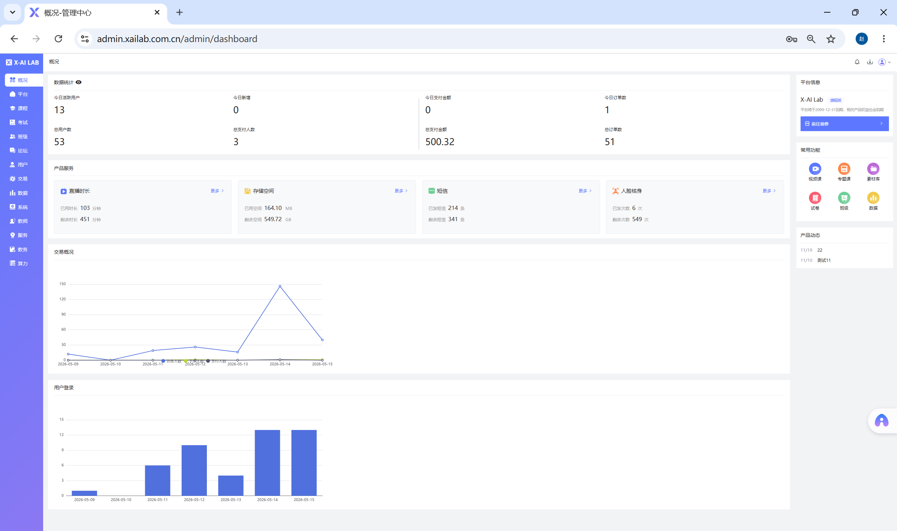

### 1.2 常用操作

1. 查看平台关键指标，包括用户、课程、订单、交易和学习相关数据。
2. 查看运营趋势图，了解近期访问、学习、交易等变化情况。
3. 通过常用功能入口快速进入课程、考试、订单、用户、系统配置等页面。
4. 根据待处理数据进入相应审核或管理页面，处理课程、班级、教师、发票等事项。

### 1.3 注意事项

1. 概况页数据用于平台运营参考，具体明细应进入对应业务模块查看。
2. 若统计数据异常，应结合数据模块、订单模块、日志模块进一步核对。

## 2. 平台

### 2.1 功能说明

“平台”菜单用于管理门户展示、移动端店铺、PC 店铺、资讯公告、证书、表单和调研问卷等运营内容。该模块主要面向平台运营管理员，用于维护用户访问门户时看到的前台内容。

### 2.2 H5 店铺

H5 店铺用于配置移动端页面装修、导航、小程序审核和首页展示内容。

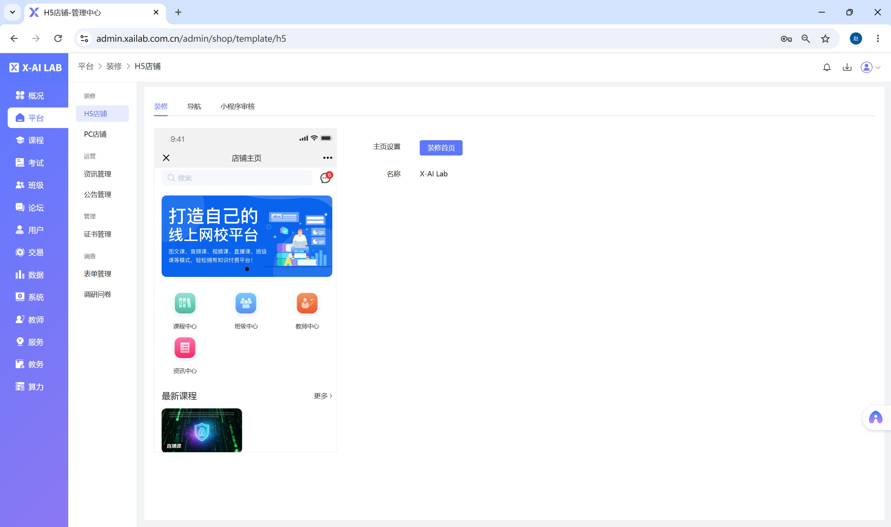

常用操作：

1. 进入 H5 店铺页面，查看当前移动端店铺装修状态。
2. 根据运营需要配置首页模块、导航、广告位和页面内容。
3. 对小程序相关内容进行审核或提交配置。
4. 保存并发布后，在移动端访问页面检查展示效果。

注意事项：

1. 发布前应检查图片尺寸、跳转链接和展示顺序。
2. 涉及首页核心入口调整时，应避开业务高峰期操作。

### 2.3 PC 店铺

PC 店铺用于配置电脑端门户页面装修、导航、悬浮窗、页脚和首页模块。

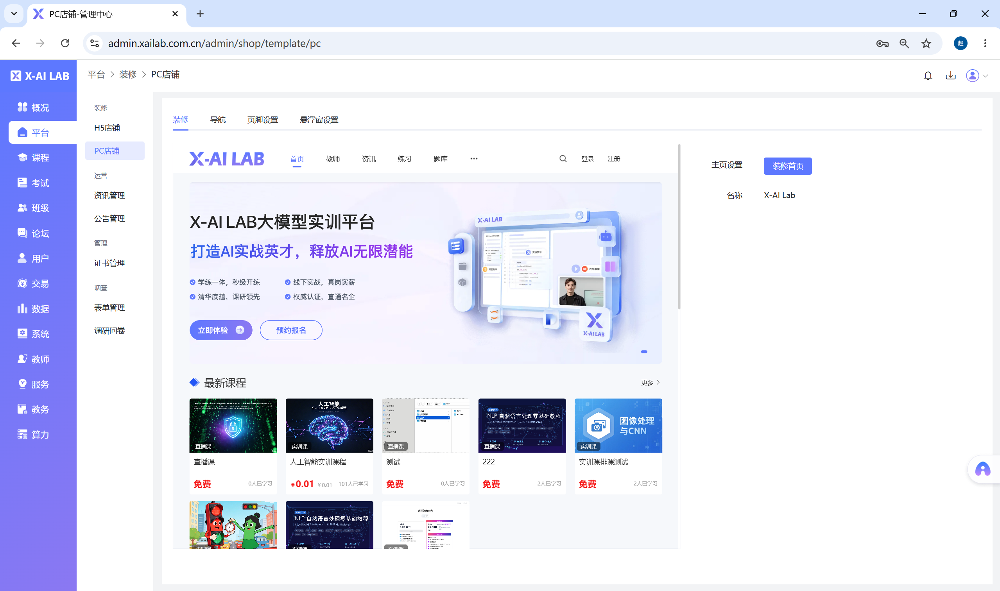

常用操作：

1. 进入 PC 店铺，查看当前电脑端门户配置。
2. 配置首页轮播、课程推荐、资讯展示、导航菜单和页脚信息。
3. 设置悬浮窗内容，例如客服入口、二维码或快捷链接。
4. 保存配置后，在门户网站检查页面显示效果。

注意事项：

1. PC 店铺影响门户首页展示，应确保链接、文字和图片内容准确。
2. 页脚信息通常包含平台介绍、联系方式、备案信息等，修改时应保持一致性。

### 2.4 资讯管理

资讯管理用于维护门户资讯内容，包括资讯分类、资讯列表和资讯广告。

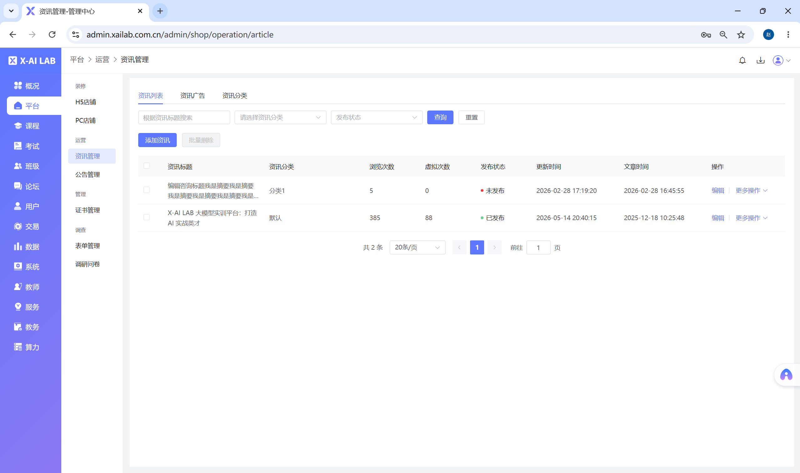

常用操作：

1. 新建资讯分类，用于按业务、课程、活动等维度管理内容。
2. 新增资讯文章，填写标题、封面、摘要、正文、分类和发布时间。
3. 对已有资讯进行编辑、上架、下架或删除。
4. 配置资讯广告位，提升重点内容曝光。

注意事项：

1. 资讯发布前应检查标题、正文、封面和附件是否正确。
2. 已发布资讯如需删除，应确认是否仍被门户或活动页面引用。

### 2.5 公告管理

公告管理用于发布平台通知、停机维护通知、考试提醒、活动通知等内容。

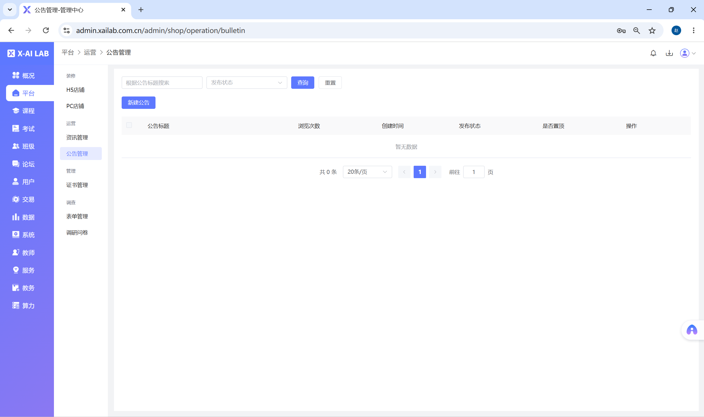

常用操作：

1. 点击新建公告，填写公告标题、内容、展示范围和发布时间。
2. 对公告进行编辑、发布、下架或删除。
3. 根据发布时间和状态筛选公告记录。

注意事项：

1. 重要公告应提前核对发布范围和展示时间。
2. 涉及系统维护、考试安排等公告，应与业务负责人确认后发布。

### 2.6 证书管理

证书管理用于创建证书模板、颁发证书、查看证书数据和管理证书状态。

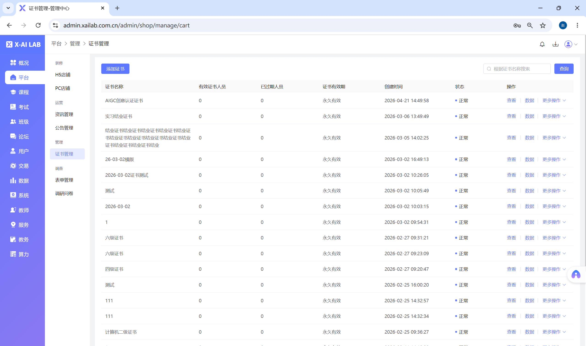

常用操作：

1. 新建证书，配置证书名称、模板、适用课程或考试规则。
2. 查看证书详情，确认证书编号、模板样式和发放条件。
3. 对符合条件的学员颁发证书。
4. 查看证书数据，统计证书发放、领取和使用情况。
5. 对不再使用的证书进行停用或删除。

注意事项：

1. 证书模板和发放规则确认后再启用，避免错误发证。
2. 已颁发证书通常涉及学员学习成果，应谨慎删除或停用。

### 2.7 表单管理

表单管理用于创建报名表、信息采集表、满意度调查表等自定义表单。

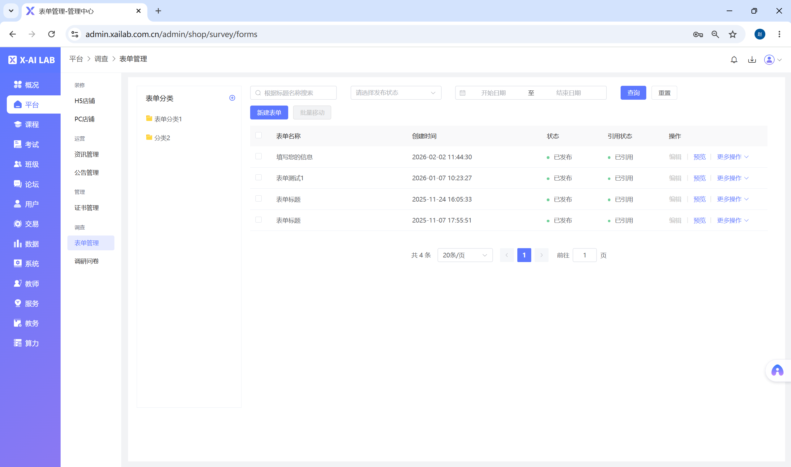

常用操作：

1. 新建表单，设置表单名称、字段、选项和提交规则。
2. 预览表单，检查字段顺序、必填项和提交效果。
3. 复制已有表单，用于快速创建相似业务表单。
4. 移动表单至指定分类或目录。
5. 删除不再使用的表单。

注意事项：

1. 表单上线前应进行预览和测试提交。
2. 删除表单前应确认是否需要保留历史提交数据。

### 2.8 调研问卷

调研问卷用于创建问卷、收集用户反馈、查看问卷链接和分析问卷数据。

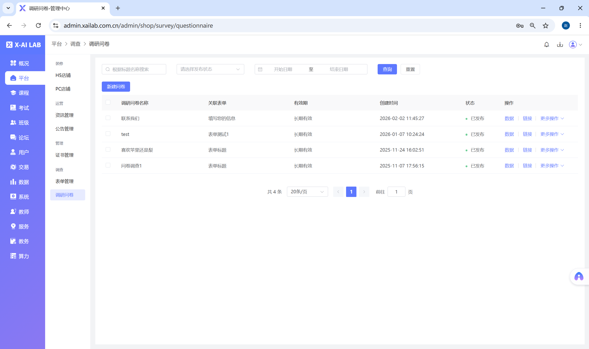

常用操作：

1. 新建问卷，配置题目、选项、提交限制和展示范围。
2. 预览问卷，检查题目逻辑和页面展示。
3. 获取问卷链接，将链接投放到公告、课程、班级或外部渠道。
4. 查看问卷数据，分析用户反馈结果。
5. 对过期或无效问卷进行删除。

注意事项：

1. 问卷投放前应确认收集目的和数据字段。
2. 涉及个人信息采集时，应明确告知用途并控制权限。

## 3. 课程

### 3.1 功能说明

“课程”菜单用于管理平台课程资源，覆盖视频课、音频课、图文课、直播课、实训课、专题课、套餐、素材、课程审核和课程排序等功能。该模块是平台教学内容建设的核心入口。

### 3.2 视频课

视频课用于发布以视频学习为主的课程内容。

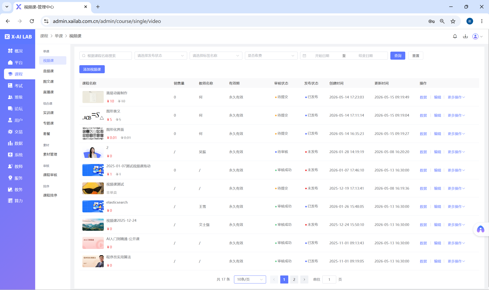

常用操作：

1. 新增视频课，填写课程名称、分类、封面、讲师、简介和课程价格等信息。
2. 上传或选择视频素材，配置课程章节和试看规则。
3. 查看课程数据，了解学习人数、购买情况、学习进度和互动数据。
4. 对课程进行编辑、发布、取消发布或删除。

注意事项：

1. 发布前应检查视频是否可正常播放。
2. 删除课程前应确认是否存在订单、学习记录或班级关联。

### 3.3 音频课

音频课用于发布以音频内容为主的课程。

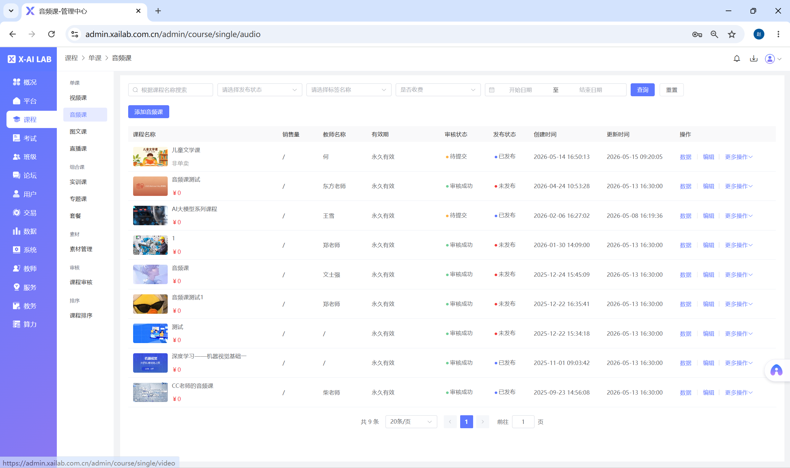

常用操作：

1. 新建音频课，填写课程基础信息。
2. 上传音频素材，配置章节目录。
3. 设置课程状态、价格、学习权限和推广信息。
4. 查看课程数据并进行后续运营优化。

注意事项：

1. 音频文件上传后应检查播放完整性。
2. 课程封面、标题和简介应保持与课程内容一致。

### 3.4 图文课

图文课用于发布以文字、图片、附件和富文本为主的课程内容。

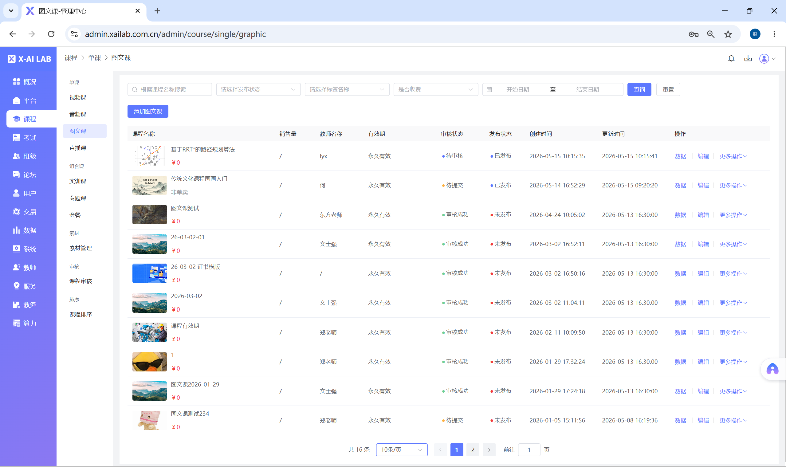

常用操作：

1. 新建图文课，填写课程基础信息。
2. 编辑课程正文、图片、附件和章节内容。
3. 发布课程后在学生端检查排版效果。
4. 根据学习反馈调整课程内容。

注意事项：

1. 图文内容应避免图片过大导致加载缓慢。
2. 关键知识点建议以标题、列表或附件形式结构化呈现。

### 3.5 直播课

直播课用于组织在线直播教学、直播回放和直播数据管理。

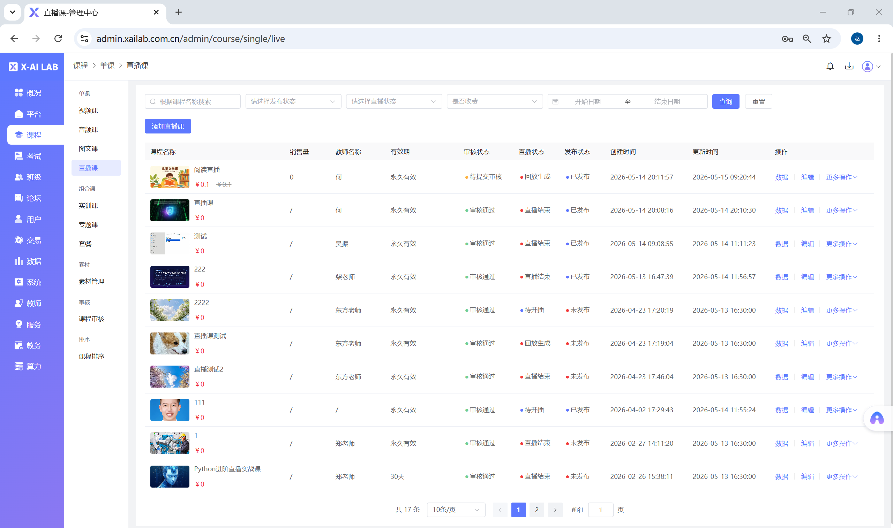

常用操作：

1. 新建直播课，设置直播标题、讲师、时间、封面和说明。
2. 配置直播信息，包括直播间、开播时间、观看权限等。
3. 根据实际情况修改直播状态或取消直播。
4. 直播结束后查看数据，并维护回放资源。

注意事项：

1. 开播前应提前测试直播间、网络、音视频设备和权限。
2. 直播时间变更后，应及时通知学员和班级。

### 3.6 实训课

实训课用于组织项目化实践课程，可关联实验环境、章节任务和实训资源。

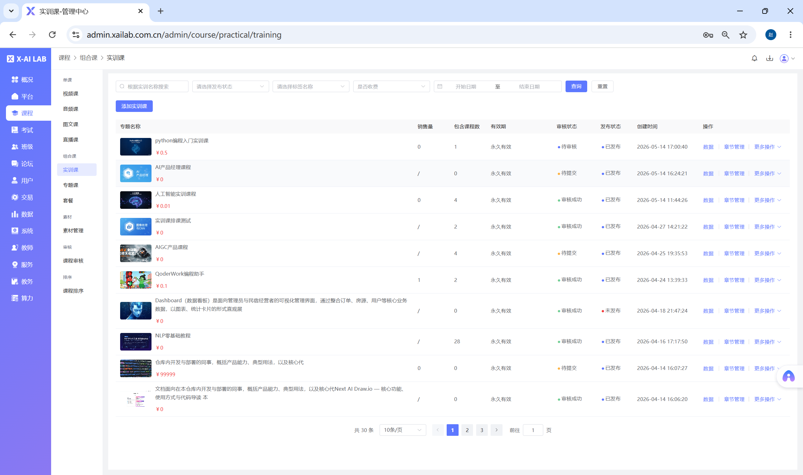

常用操作：

1. 新建实训课，配置课程名称、封面、讲师、介绍和适用方向。
2. 进入章节管理，维护实训任务、实验说明和配套资源。
3. 发布课程后，学员可在学生端进入学习和实训。
4. 查看数据，跟踪学习人数、实训完成情况和课程效果。

注意事项：

1. 实训课通常依赖实验环境或算力资源，发布前应确认资源可用。
2. 停止更新或取消发布前，应评估对正在学习学员的影响。

### 3.7 专题课

专题课用于将多个课程、章节或学习资源按主题组织成专题。

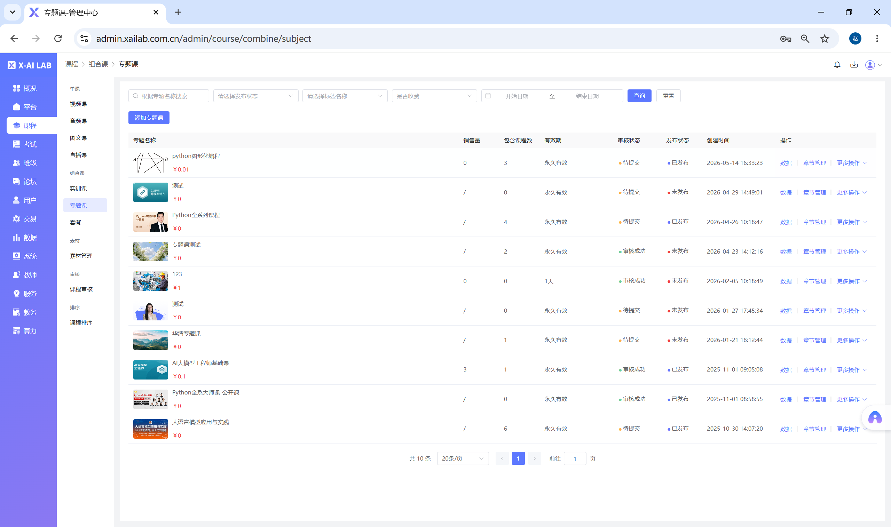

常用操作：

1. 新增专题课，填写专题信息和展示封面。
2. 通过章节管理组织专题目录。
3. 关联课程、视频、图文、实训等内容。
4. 查看专题数据，了解专题学习和转化情况。

注意事项：

1. 专题课适合主题化、路径化学习场景，应保持内容顺序清晰。
2. 删除专题前应确认是否影响已配置的学习路径。

### 3.8 套餐

套餐用于将多个课程或专题组合销售或统一分配。

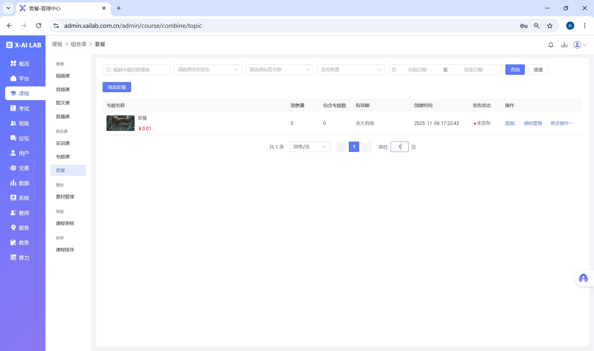

常用操作：

1. 新增套餐，填写套餐名称、封面、简介和价格。
2. 通过章节或内容管理关联课程资源。
3. 设置发布状态和销售规则。
4. 查看套餐数据，分析购买、学习和转化情况。

注意事项：

1. 套餐内课程发生变更时，应检查前台展示和购买权益。
2. 删除套餐前应确认是否存在订单或用户权益。

### 3.9 素材管理

素材管理用于统一管理课程建设所需的视频、音频、图片、文档、压缩包和卡片素材。

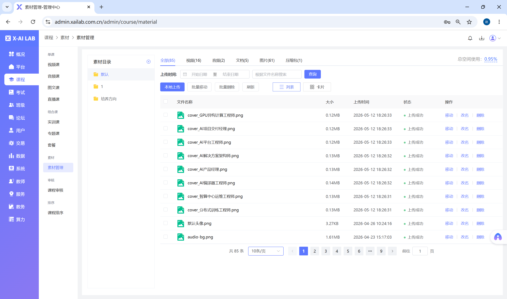

常用操作：

1. 上传素材，并按类型或文件夹进行归类。
2. 使用筛选条件查看全部、视频、音频、图片、文档、压缩包等素材。
3. 批量移动素材，整理素材目录。
4. 批量删除无效素材。

注意事项：

1. 删除素材前应确认素材未被课程、资讯或页面装修引用。
2. 大文件上传后应检查转码、预览和播放效果。

### 3.10 课程审核

课程审核用于处理教师或内容人员提交的课程审核事项。

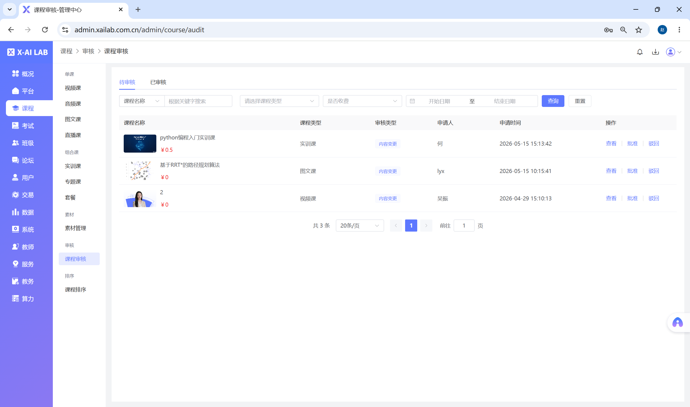

常用操作：

1. 进入待审核列表，查看待审核课程。
2. 打开课程详情，核对课程名称、封面、章节、内容、价格和讲师信息。
3. 审核通过后课程进入可发布或已审核状态。
4. 审核不通过时填写原因，便于提交人修改。

注意事项：

1. 审核课程时应重点检查内容合规性、版权、标题封面和课程完整度。
2. 审核结果会影响前台展示和教师后续操作，应谨慎处理。

### 3.11 课程排序

课程排序用于调整课程在前台、分类或推荐位中的展示顺序。

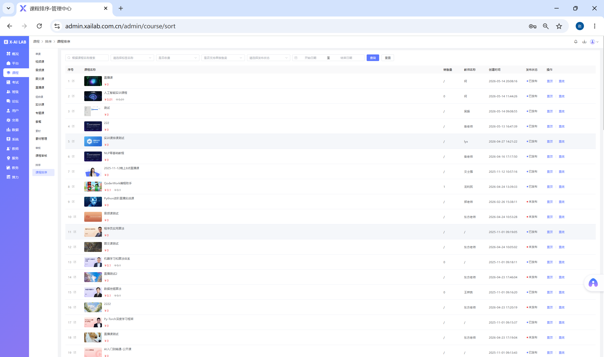

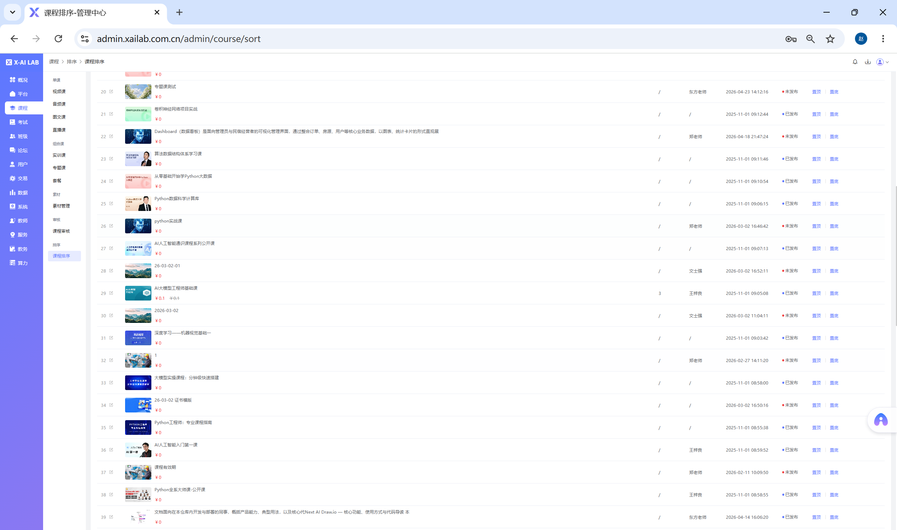

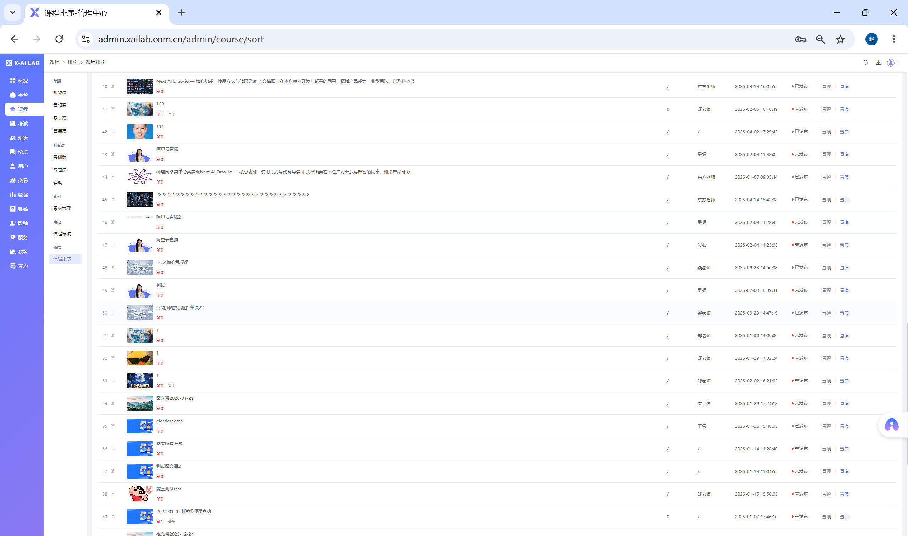

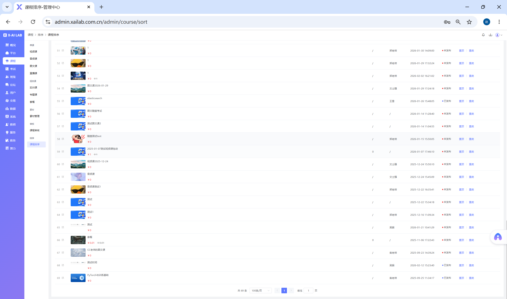

常用操作：

1. 按分类或展示位置查看课程排序列表。
2. 使用置顶、置底或拖拽等方式调整课程顺序。
3. 保存排序结果后，在前台页面检查展示顺序。

注意事项：

1. 推荐位排序会影响用户点击和学习转化，应按运营策略调整。
2. 调整后如前台未立即生效，可检查缓存或刷新页面。

## 4. 考试

### 4.1 功能说明

“考试”菜单用于管理考试、练习、题库、题目库和试卷库，是平台测评体系的核心模块。管理员可创建正式考试、模拟考试和多种练习，并维护题目、试卷和题库资源。

### 4.2 考试管理

考试管理用于新建、发布、延期、分享和查看正式考试数据。

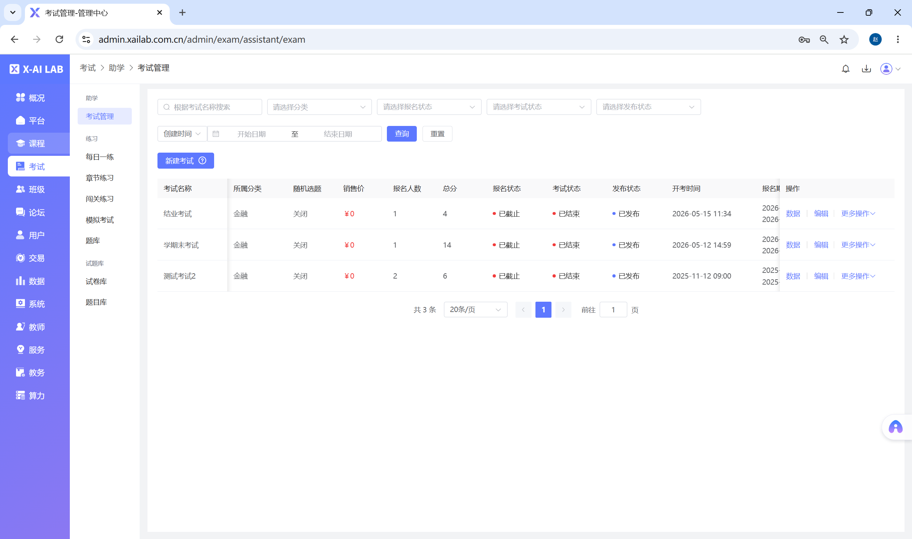

常用操作：

1. 新建考试，设置考试名称、时间、题目范围、考试规则和报名规则。
2. 发布考试后，学员可在学生端查看并参加考试。
3. 使用分享链接将考试入口发送给指定学员或班级。
4. 如需调整时间，可进行报名或开考延期。
5. 查看考试数据，分析报名人数、参考人数、成绩和通过率。
6. 对无效考试进行取消发布或删除。

注意事项：

1. 正式考试发布前应完整检查题目、时间、次数、防作弊和成绩规则。
2. 考试开始后修改规则可能影响公平性，应严格控制权限。

### 4.3 每日一练

每日一练用于配置每日练习任务，帮助学员持续刷题。

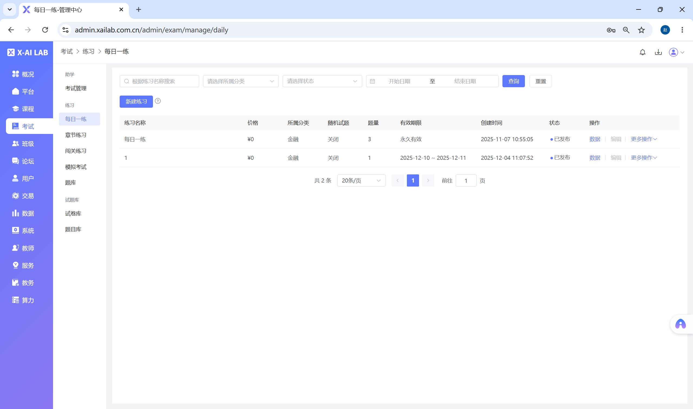

常用操作：

1. 新建每日一练，设置题目来源、练习时间和展示范围。
2. 查看练习数据，了解参与人数和正确率。
3. 删除过期或无效练习。

注意事项：

1. 每日一练题目数量不宜过多，应便于学员持续完成。
2. 题目来源应与当前学习阶段匹配。

### 4.4 章节练习

章节练习用于按课程章节配置练习题。

常用操作：

1. 新建章节练习，选择课程和章节。
2. 关联题库或题目，设置练习规则。
3. 查看练习数据，评估章节掌握情况。

注意事项：

1. 章节练习应与课程章节知识点一致。
2. 题目难度应覆盖基础、进阶和综合应用。

### 4.5 闯关练习

闯关练习用于将题目组织为关卡式训练任务。

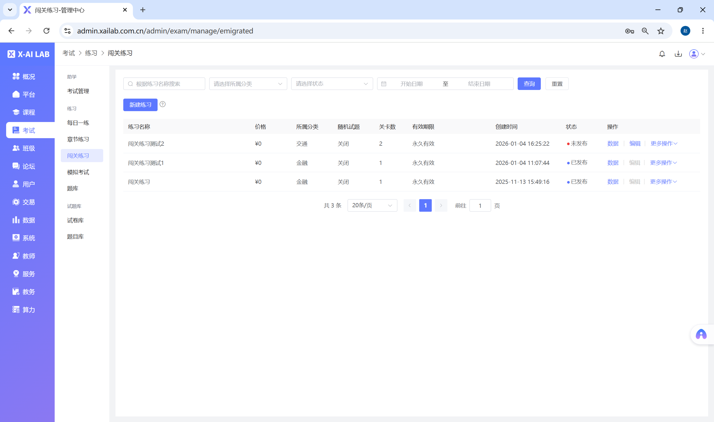

常用操作：

1. 新建闯关练习，设置关卡名称、题目范围和通过条件。
2. 查看闯关数据，了解学员通过率和薄弱环节。
3. 删除或调整不再使用的关卡。

注意事项：

1. 闯关难度应逐步提升，避免前置关卡过难。
2. 修改关卡规则前应确认是否有学员正在参与。

### 4.6 模拟考试

模拟考试用于创建非正式考试，帮助学员进行考前训练。

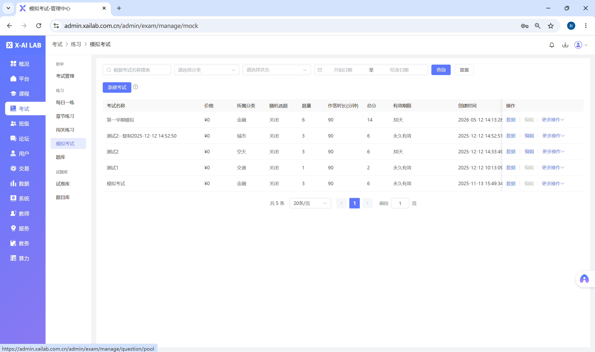

常用操作：

1. 新建模拟考试，配置试卷、考试时长和提交规则。
2. 复制已有模拟考试，快速创建相似考试。
3. 查看考试数据，分析训练效果。
4. 删除过期模拟考试。

注意事项：

1. 模拟考试可用于训练，不应与正式考试成绩混淆。
2. 试卷难度应贴近正式考试要求。

### 4.7 题库

题库用于按课程、方向或知识领域组织题目资源。

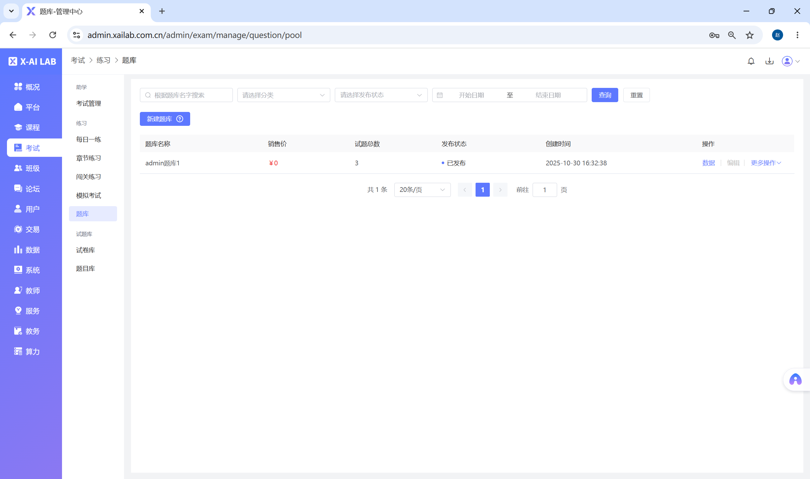

常用操作：

1. 新建题库，设置题库名称、分类、说明和状态。
2. 将题目归入对应题库。
3. 查看题库数据，了解题目数量和使用情况。
4. 取消发布或删除无效题库。

注意事项：

1. 题库结构应与课程体系和培养方向保持一致。
2. 删除题库前应确认题库未被考试、练习或试卷引用。

### 4.8 题目库

题目库用于管理单选、多选、判断、填空、问答等具体题目。

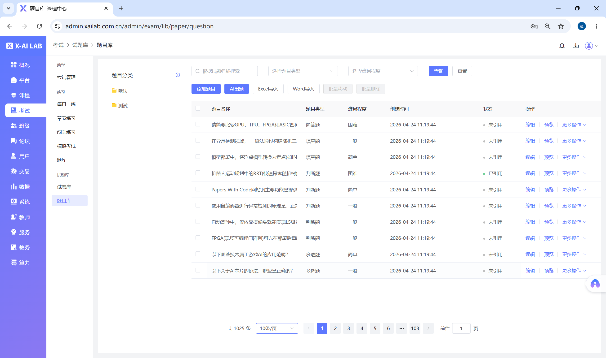

常用操作：

1. 手动添加题目，填写题干、选项、答案、解析、难度和所属题库。
2. 使用 Excel 或 Word 导入批量题目。
3. 使用 AI 出题辅助生成题目，再由管理员审核修改。
4. 预览题目，检查显示效果和答案解析。
5. 复制、移动或删除题目。

注意事项：

1. 批量导入前应使用平台模板，避免字段不匹配。
2. AI 出题结果必须人工审核，确保准确性和适用性。

### 4.9 试卷库

试卷库用于维护考试和练习所需试卷。

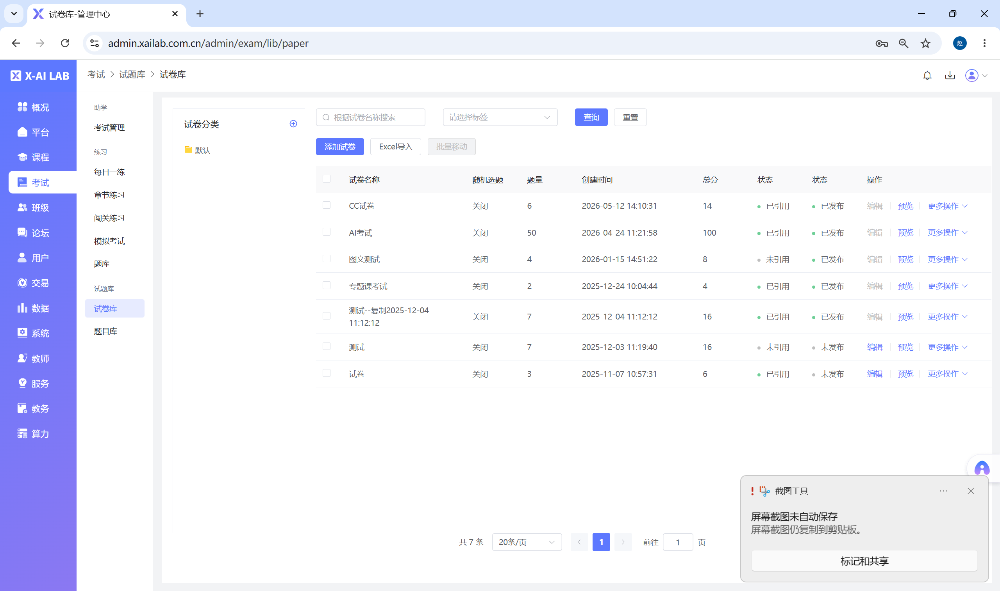

常用操作：

1. 添加试卷，设置试卷名称、题目组成、分值和考试规则。
2. 通过 Excel 导入试卷。
3. 预览试卷，检查题目顺序、分值和答案。
4. 复制、移动或删除试卷。
5. 导出试卷，用于线下存档或审核。

注意事项：

1. 正式考试试卷发布前应经过复核。
2. 删除试卷前应确认未被考试或练习引用。

## 5. 班级

### 5.1 功能说明

“班级”菜单用于管理教学班级、班级成员、班级课程和班级审核。教务管理员可通过该模块完成班级创建、发布、邀请学员和审核管理。

### 5.2 班级管理

班级管理用于创建和维护班级。

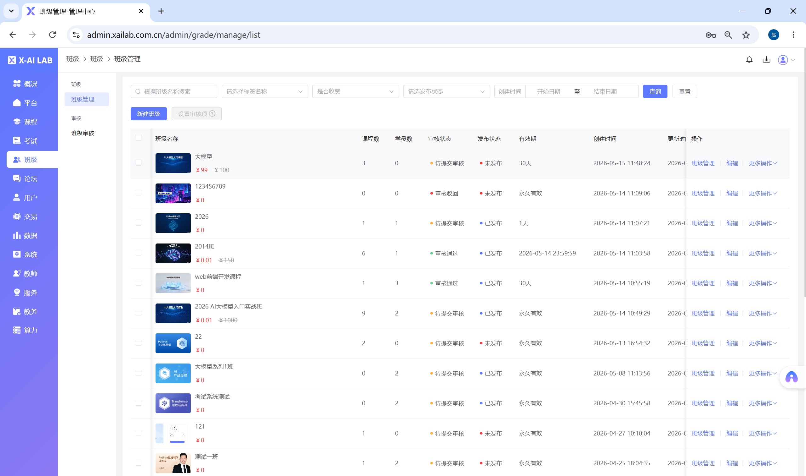

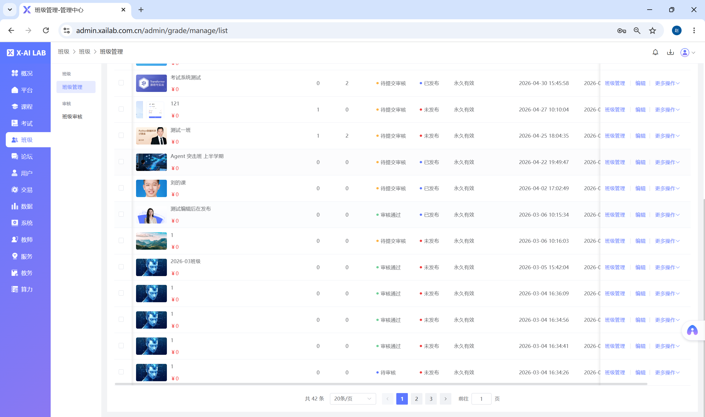

常用操作：

1. 添加班级，填写班级名称、学期、培养方向、班主任或教师信息。
2. 管理班级成员、课程、考试和学习任务。
3. 邀请学员加入班级。
4. 设置加入班级的审核项。
5. 取消发布或删除不再使用的班级。

注意事项：

1. 班级创建后应确认学期、培养方向和课程配置是否正确。
2. 删除班级前应确认是否存在学员学习记录和考试数据。

### 5.3 班级审核

班级审核用于处理学员加入班级或班级相关申请。

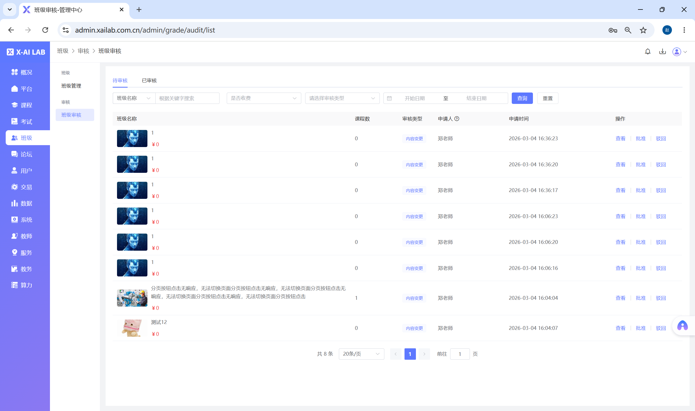

常用操作：

1. 查看待审核列表，确认申请人信息和申请班级。
2. 审核通过后，申请人进入对应班级。
3. 审核不通过时填写原因。
4. 在已审核列表查看历史审核记录。

注意事项：

1. 班级审核应核对学员身份、所属组织和申请理由。
2. 批量审核前应确认筛选条件准确。

## 6. 论坛

### 6.1 功能说明

“论坛”菜单用于管理学习社区中的话题、话题分类和话题审核，帮助平台维护良好的学习交流氛围。

### 6.2 话题管理

话题管理用于查看、禁用、删除和查看话题详情。

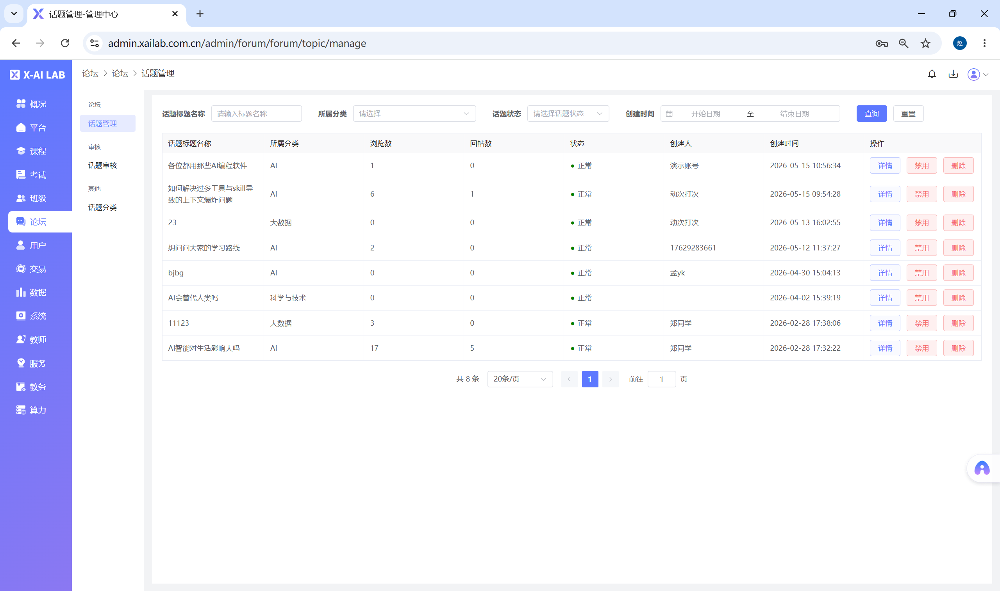

常用操作：

1. 根据关键词、分类或状态筛选话题。
2. 查看话题详情，检查提问内容、回复和互动情况。
3. 对违规或不适宜展示的话题进行禁用。
4. 删除无效或违规话题。

注意事项：

1. 处理话题时应遵循平台内容规范。
2. 对学习价值较高的话题可保留或引导沉淀为知识内容。

### 6.3 话题分类

话题分类用于维护论坛中的分类标签。

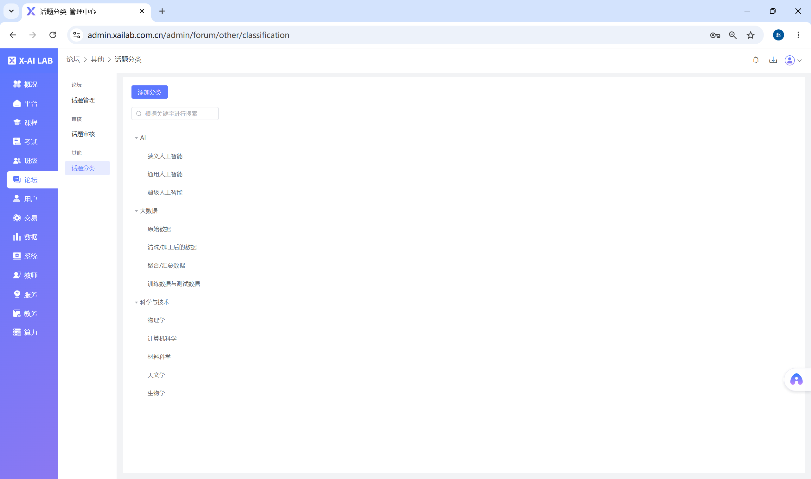

常用操作：

1. 添加分类，填写分类名称和排序。
2. 编辑分类名称或展示顺序。
3. 停用或删除不再使用的分类。

注意事项：

1. 分类名称应简洁清晰，便于学员发帖选择。
2. 删除分类前应确认该分类下是否存在话题。

### 6.4 话题审核

话题审核用于处理待审核和已审核话题。

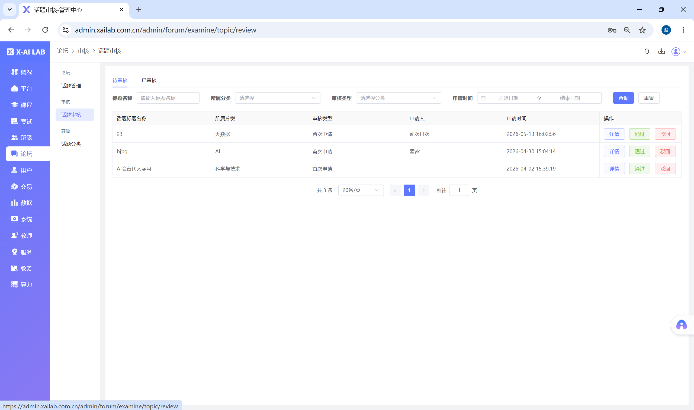

常用操作：

1. 进入待审核列表，查看待审核话题。
2. 审核通过后话题可在前台展示。
3. 审核不通过时填写原因。
4. 在已审核列表查看审核记录。

注意事项：

1. 涉及广告、违规、隐私、敏感信息的话题应拒绝或删除。
2. 审核记录可用于后续内容治理和责任追溯。

## 7. 用户

### 7.1 功能说明

“用户”菜单用于管理平台用户、教师、教师角色和教师审核。管理员可查看用户信息、教师信息、在线状态和角色权限。

### 7.2 用户列表

用户列表用于查看全部用户和在线用户。

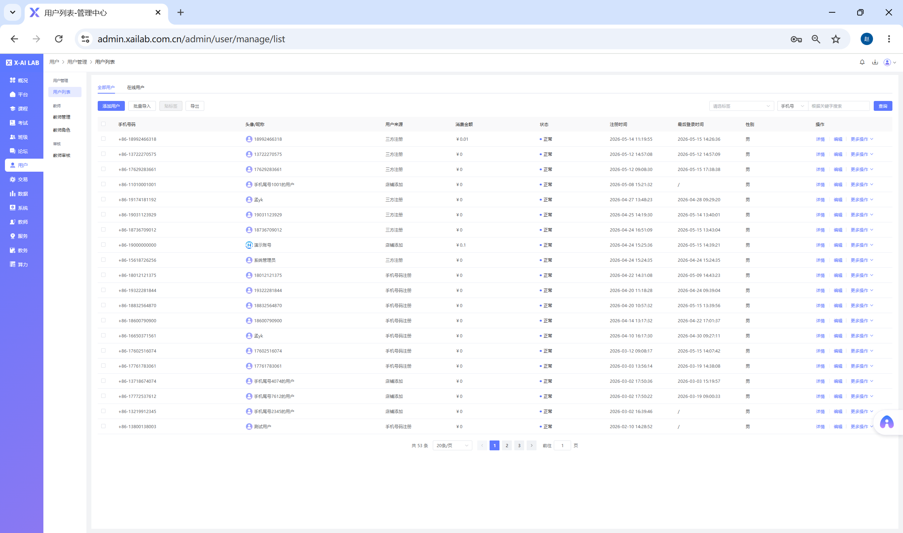

常用操作：

1. 按手机号、姓名、状态、注册时间等条件筛选用户。
2. 查看用户基础信息、学习记录、订单和账户状态。
3. 查看在线用户，了解当前平台活跃情况。
4. 根据管理要求对用户状态进行处理。

注意事项：

1. 用户信息涉及个人隐私，应控制查看和导出权限。
2. 修改用户状态前应确认原因和影响范围。

### 7.3 教师管理

教师管理用于维护教师列表和教师等级。

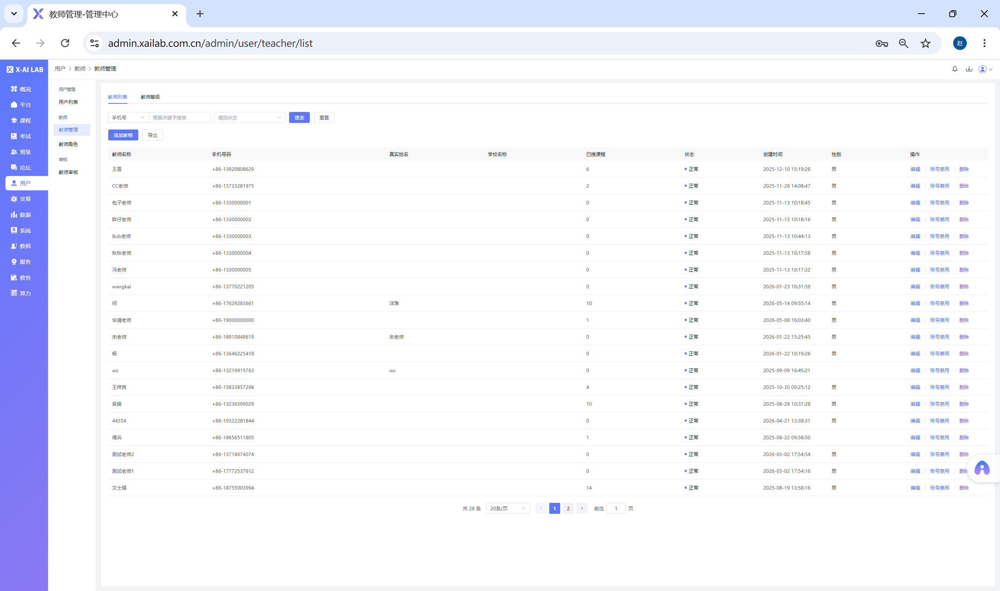

常用操作：

1. 查看教师列表，筛选教师姓名、状态、等级等信息。
2. 维护教师等级，用于前台展示、课程归属或权限区分。
3. 编辑教师信息，维护简介、头像、擅长方向等内容。

注意事项：

1. 教师信息会影响课程展示和学员选择，应保持准确。
2. 调整教师状态前应确认是否影响其已发布课程。

### 7.4 教师角色

教师角色用于配置教师端菜单权限。

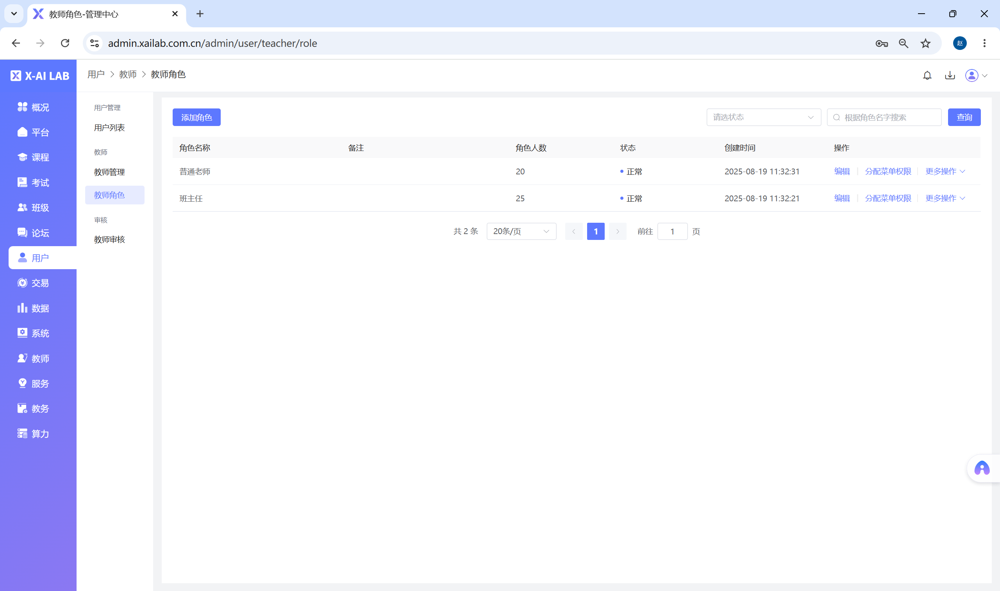

常用操作：

1. 添加教师角色，设置角色名称和说明。
2. 分配菜单权限，控制教师可使用的功能范围。
3. 禁用或删除不再使用的角色。

注意事项：

1. 分配权限时应遵循最小权限原则。
2. 删除角色前应确认无教师正在使用该角色。

### 7.5 教师审核

教师审核用于处理教师入驻或教师信息变更审核。

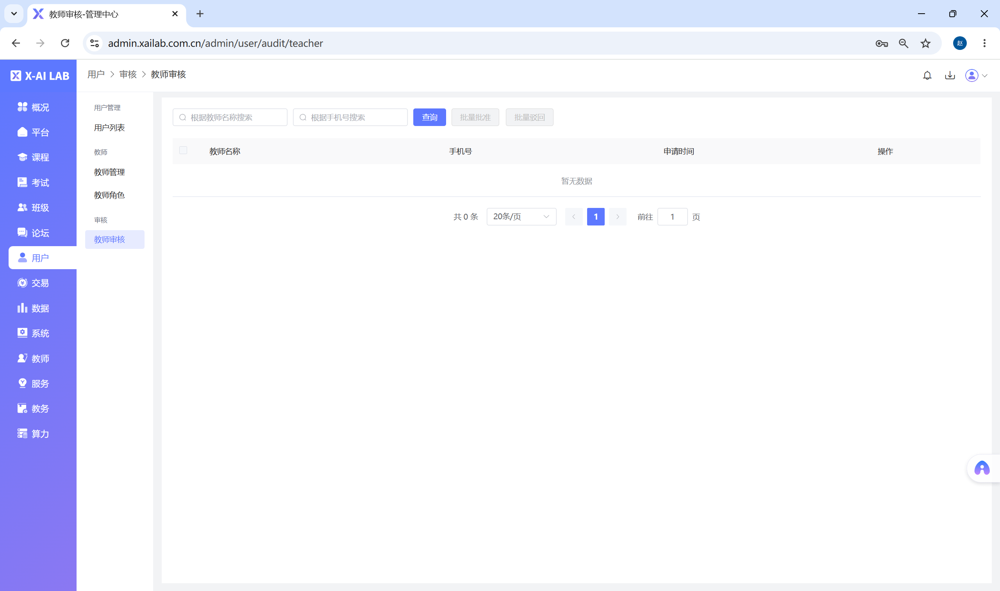

常用操作：

1. 查看待审核教师申请。
2. 核对教师姓名、资质、简介、联系方式和申请材料。
3. 审核通过后，教师可进入对应功能范围。
4. 审核不通过时填写原因。

注意事项：

1. 教师审核应关注身份真实性和资质合规性。
2. 审核通过后应及时分配合适角色。

## 8. 交易

### 8.1 功能说明

“交易”菜单用于管理订单、支付配置、发票、提现和收益明细。该模块通常由运营、财务或平台管理员使用。

### 8.2 订单管理

订单管理用于查询订单、导出订单、查看详情、备注和退款处理。

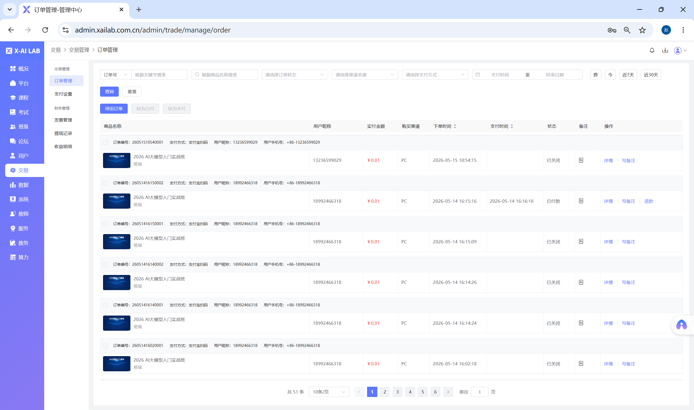

常用操作：

1. 按订单号、用户、商品、支付状态、时间等条件筛选订单。
2. 查看订单详情，核对商品、金额、支付渠道和用户信息。
3. 为订单添加备注，记录处理情况。
4. 导出订单，用于财务统计或对账。
5. 对符合规则的订单发起退款。

注意事项：

1. 退款操作会影响用户权益和财务数据，应核对后执行。
2. 订单导出文件应按财务和隐私要求保存。

### 8.3 支付设置

支付设置用于配置平台支付渠道和支付密钥信息。

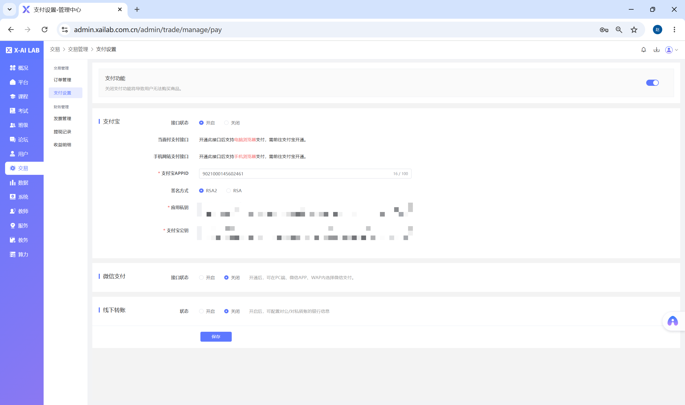

常用操作：

1. 查看当前支付渠道配置状态。
2. 配置支付商户号、支付密钥、回调地址等参数。
3. 保存后进行支付测试，确认订单支付和回调正常。

注意事项：

1. 支付密钥属于敏感信息，不应截图外传或明文共享。
2. 修改支付配置前应备份原配置，并在低峰期验证。

### 8.4 发票管理

发票管理用于处理用户开票申请。

常用操作：

1. 查看待审核发票申请。
2. 核对订单、抬头、税号、金额和邮箱等信息。
3. 审核通过后按财务流程开票。
4. 在已审核列表查看历史记录。

注意事项：

1. 发票信息涉及财务合规，应严格核对。
2. 审核驳回时应填写明确原因，便于用户修改。

### 8.5 提现记录

提现记录用于处理教师或相关收益账户的提现申请。

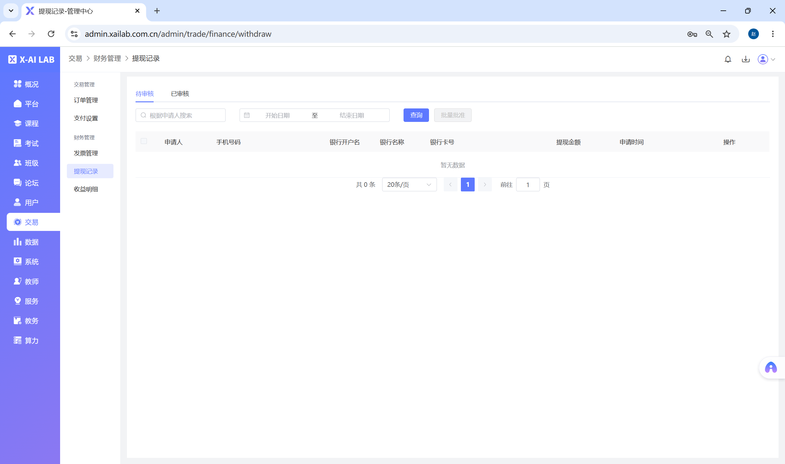

常用操作：

1. 查看待审核提现申请。
2. 核对提现人、金额、账户和收益来源。
3. 审核通过后进入财务支付流程。
4. 在已审核列表查看处理记录。

注意事项：

1. 提现审核应结合收益明细进行核对。
2. 金额异常或账户异常时，应暂停处理并联系相关人员确认。

### 8.6 收益明细

收益明细用于查看平台或教师相关收益流水。

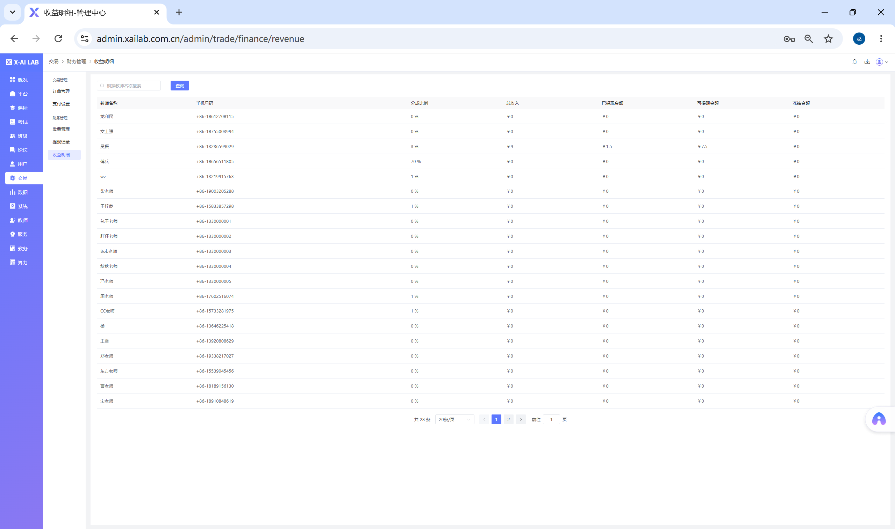

常用操作：

1. 按时间、用户、课程、订单等条件筛选收益记录。
2. 查看收益来源、金额、结算状态和关联订单。
3. 导出数据用于财务核算。

注意事项：

1. 收益明细应与订单、退款和提现记录联动核对。
2. 导出数据应妥善保存，避免泄露财务信息。

## 9. 数据

### 9.1 功能说明

“数据”菜单用于查看平台经营、用户、商品、交易、下载任务和可视化大屏等数据。管理员可通过该模块掌握平台运行状态和业务效果。

### 9.2 数据概览

数据概览展示平台整体数据指标和趋势。

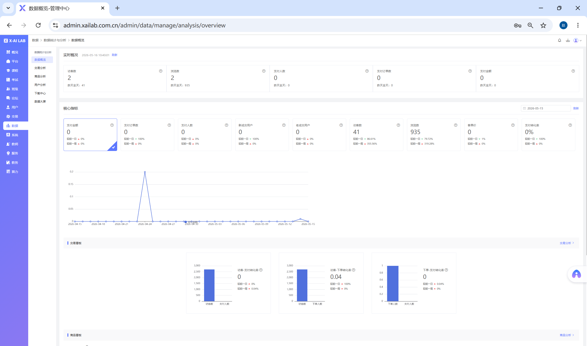

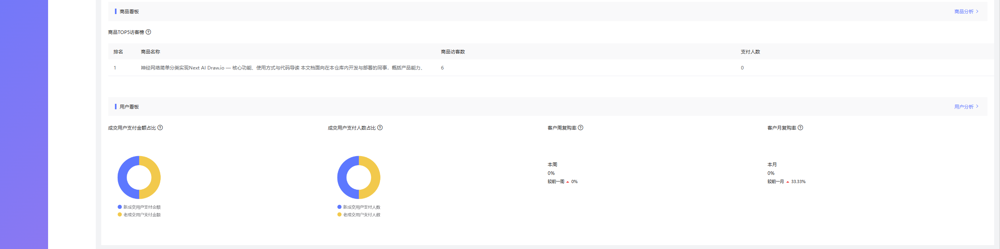

常用操作：

1. 查看整体用户、访问、课程、交易等核心数据。
2. 按时间范围筛选数据。
3. 对异常波动进行业务排查。

注意事项：

1. 数据概览用于整体判断，具体原因需进入明细模块分析。
2. 分析时应结合活动、课程发布和考试安排等运营背景。

### 9.3 交易分析

交易分析用于查看订单、收入、支付和转化相关数据。

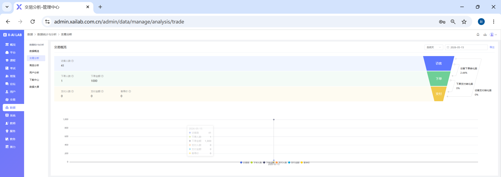

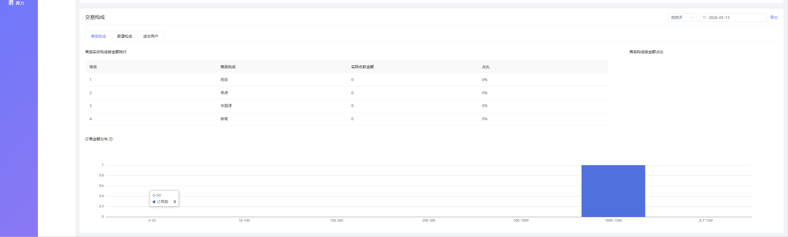

常用操作：

1. 查看交易金额、订单量、支付转化和退款情况。
2. 按时间、商品或渠道分析交易表现。
3. 对交易异常进行排查。

注意事项：

1. 交易数据应与订单管理和支付平台数据交叉核对。
2. 大促活动期间应重点关注支付成功率和退款率。

### 9.4 用户分析

用户分析用于查看用户增长、活跃、留存和行为数据。

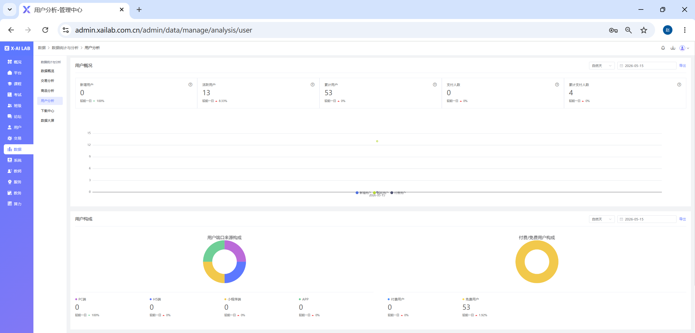

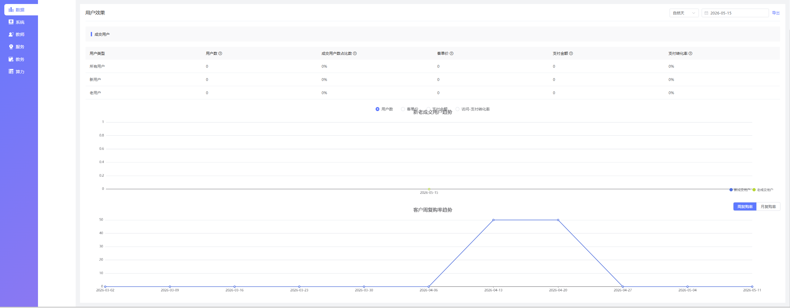

常用操作：

1. 查看新增用户、活跃用户和用户来源。
2. 分析用户学习、购买和访问行为。
3. 根据数据优化课程推荐和运营策略。

注意事项：

1. 用户分析应结合课程、班级和活动数据综合判断。
2. 用户行为数据涉及隐私，应按权限查看。

### 9.5 商品分析

商品分析用于查看课程、套餐等商品的访问、购买和学习数据。

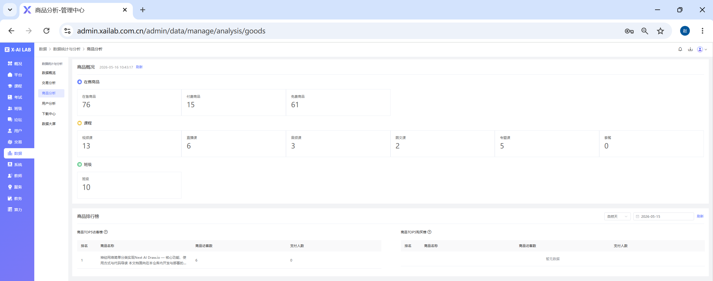

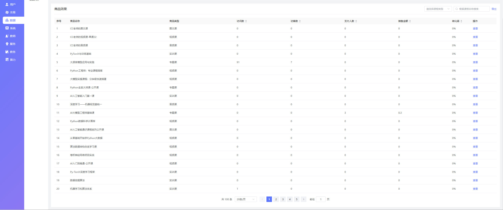

常用操作：

1. 查看课程或商品浏览量、购买量、转化率和收入。
2. 分析不同课程类型的运营效果。
3. 根据数据调整课程排序、推荐位和营销内容。

注意事项：

1. 商品数据应与课程内容质量、价格和推广活动结合分析。
2. 对低转化课程应检查标题、封面、详情页和课程评价。

### 9.6 数据大屏

数据大屏用于展示平台核心数据的可视化看板。

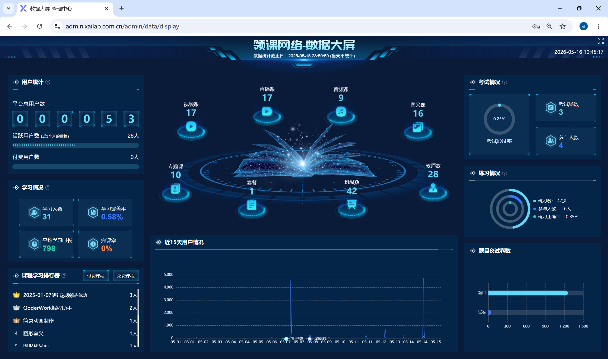

常用操作：

1. 打开数据大屏，查看实时或周期性运营数据。
2. 在会议、汇报或监控场景中展示大屏内容。
3. 根据业务需要切换展示视图。

注意事项：

1. 数据大屏适合展示趋势和概况，不替代明细分析。
2. 外部展示前应确认是否包含敏感数据。

### 9.7 下载中心

下载中心用于管理导出文件和下载记录。

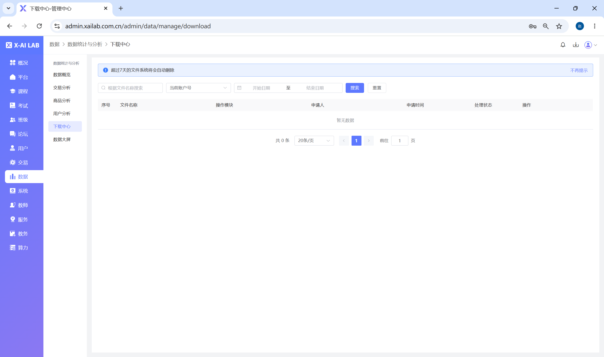

常用操作：

1. 查看导出任务状态。
2. 下载已生成的文件。
3. 删除过期或无效下载记录。

注意事项：

1. 导出文件可能包含用户、订单或财务信息，应限制下载权限。
2. 下载完成后应按数据安全要求保存和清理。

## 10. 系统

### 10.1 功能说明

“系统”菜单用于维护平台基础配置、分类标签、权限账号、日志、域名、第三方应用、通知、分享图、推送和锚文本等全局设置。该模块对平台运行影响较大，通常由平台管理员维护。

### 10.2 基础设置

基础设置用于维护网站、小程序、登录、发票、内容防盗、默认配置和更多系统参数。

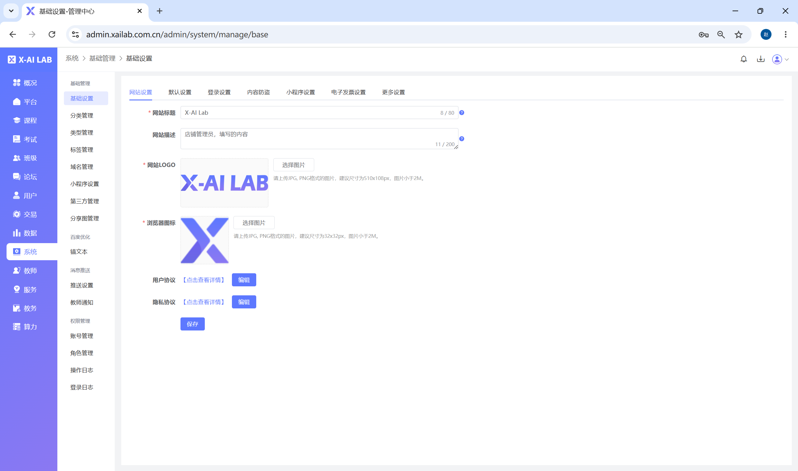

常用操作：

1. 配置网站名称、Logo、联系方式、默认图片等基础信息。
2. 配置登录方式、注册规则和安全策略。
3. 配置电子发票、内容防盗、小程序等相关参数。
4. 保存后检查前台和后台展示是否正常。

注意事项：

1. 基础设置影响全站，应由授权管理员操作。
2. 修改登录、发票、小程序等配置后，应进行完整验证。

### 10.3 小程序设置

小程序设置用于维护小程序端相关参数。

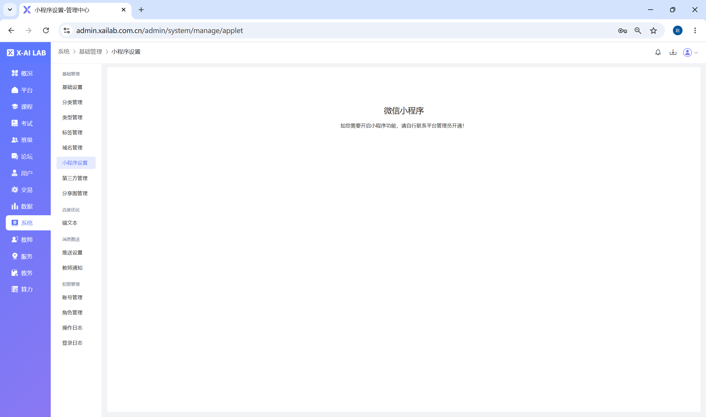

常用操作：

1. 查看小程序配置状态。
2. 配置小程序 AppID、密钥、页面路径等参数。
3. 保存后进行小程序端访问测试。

注意事项：

1. 小程序密钥属于敏感信息，应妥善保管。
2. 修改配置后应同步检查移动端登录、支付和页面跳转。

### 10.4 分类管理

分类管理用于维护课程、资讯、题库等业务分类。

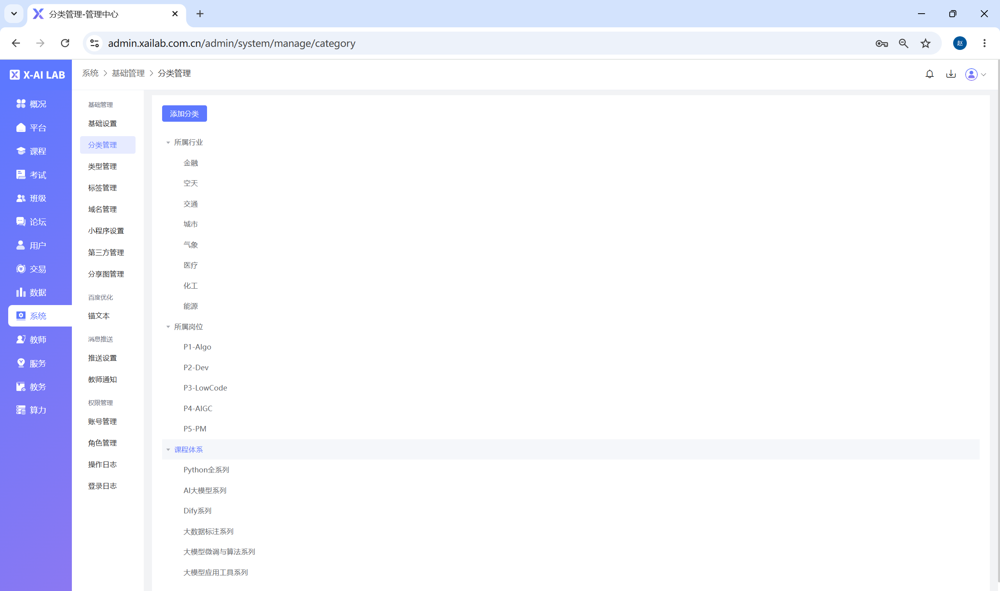

常用操作：

1. 新增分类，填写分类名称、层级和排序。
2. 编辑分类信息。
3. 启用、停用或删除分类。

注意事项：

1. 分类结构会影响前台筛选和后台归档，应保持清晰。
2. 删除分类前应确认是否存在关联内容。

### 10.5 标签管理

标签管理用于维护课程、资讯、题目等内容标签。

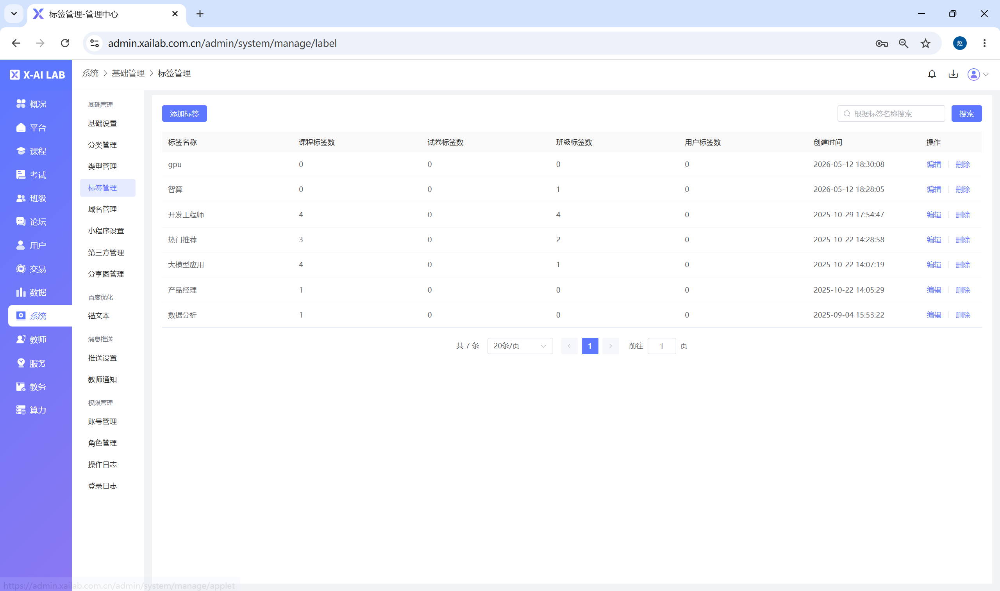

常用操作：

1. 添加标签，填写标签名称和适用范围。
2. 编辑标签内容。
3. 删除不再使用的标签。

注意事项：

1. 标签应简洁统一，避免重复或同义标签过多。
2. 删除标签前应确认是否影响内容检索。

### 10.6 角色管理

角色管理用于配置后台管理员角色和菜单权限。

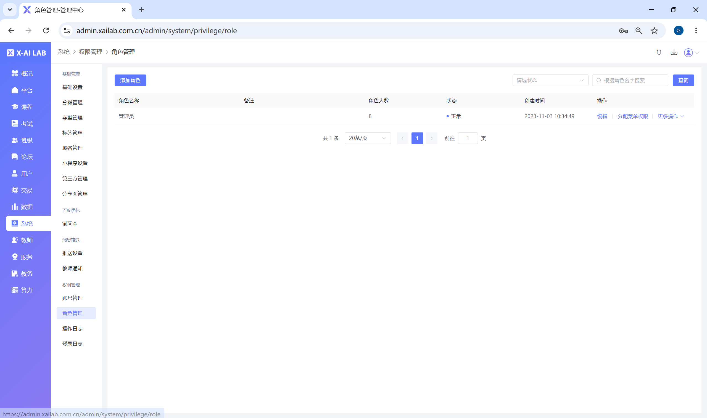

常用操作：

1. 添加角色，填写角色名称和说明。
2. 分配菜单权限和操作权限。
3. 禁用或删除不再使用的角色。

注意事项：

1. 权限配置应遵循最小权限原则。
2. 超级管理员、财务、运维等关键角色应分开配置。

### 10.7 账号管理

账号管理用于创建和维护后台登录账号。

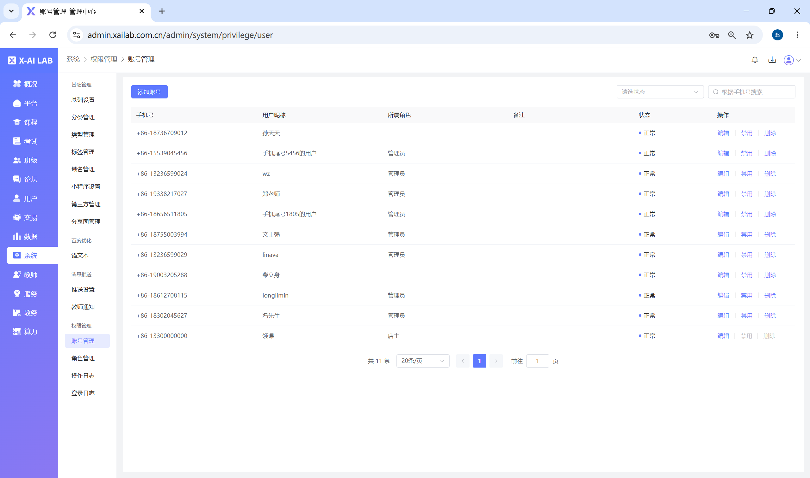

常用操作：

1. 添加账号，设置账号信息、登录密码和所属角色。
2. 编辑账号信息或调整角色。
3. 禁用异常账号。
4. 删除不再使用的账号。

注意事项：

1. 管理员账号应定期核查，及时关闭离职或无效账号。
2. 修改角色权限后，应通知对应人员重新登录验证。

### 10.8 登录日志

登录日志用于查看后台或平台账号登录记录。

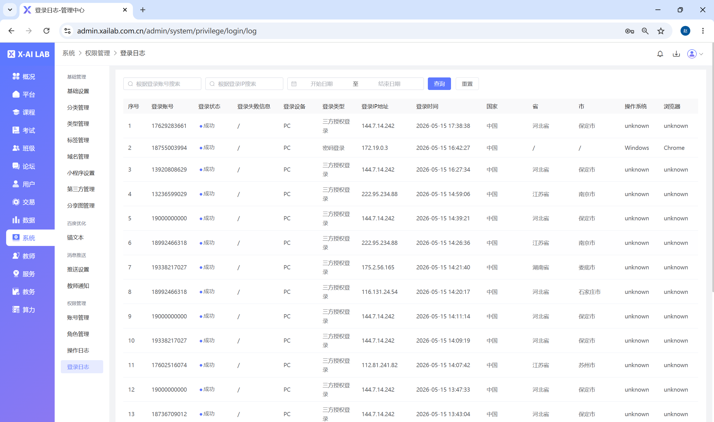

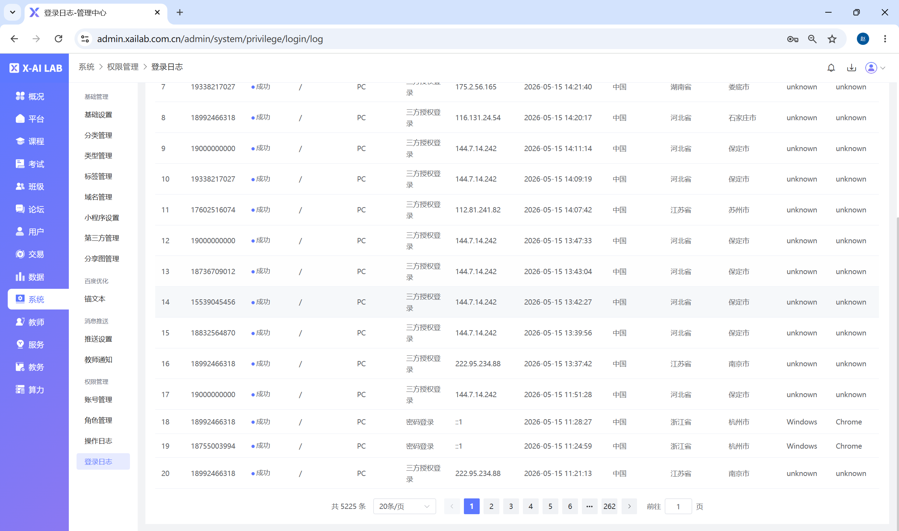

常用操作：

1. 按账号、时间、IP、登录状态等条件筛选日志。
2. 查看异常登录记录。
3. 导出或记录安全审计信息。

注意事项：

1. 多次失败登录、异地登录或异常 IP 应重点关注。
2. 登录日志可用于安全追溯，不应随意删除。

### 10.9 操作日志

操作日志用于记录后台管理员的重要操作行为。

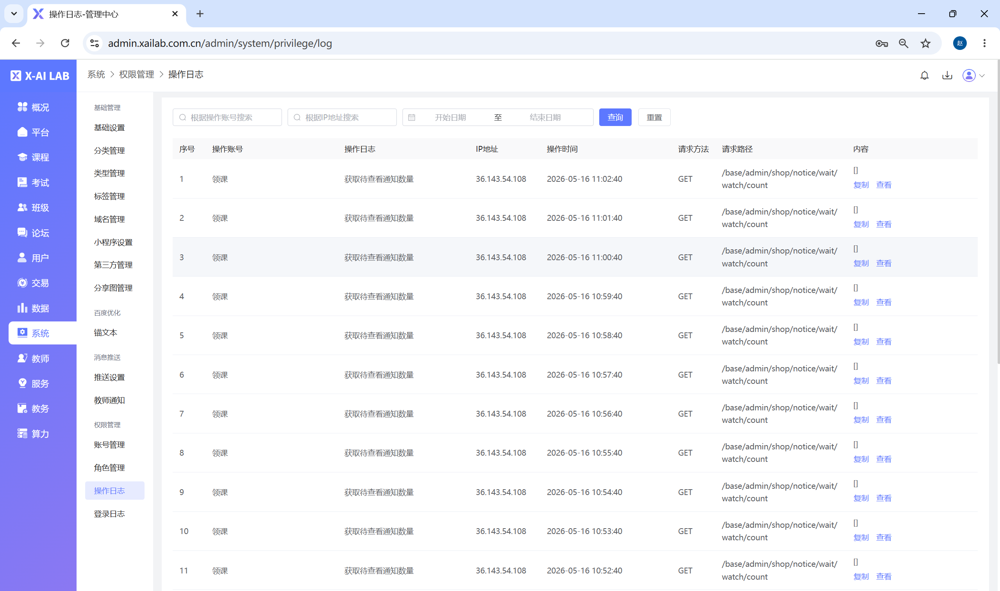

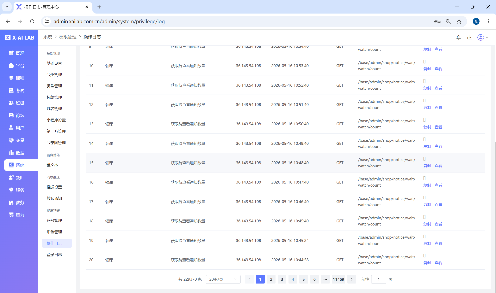

常用操作：

1. 按操作人、模块、时间和操作类型筛选日志。
2. 查看操作详情，定位配置变更或异常操作。
3. 用于审计、排错和责任追溯。

注意事项：

1. 涉及权限、支付、删除、审核等操作应重点审计。
2. 日志数据应保持完整性。

### 10.10 域名管理

域名管理用于维护平台访问域名。

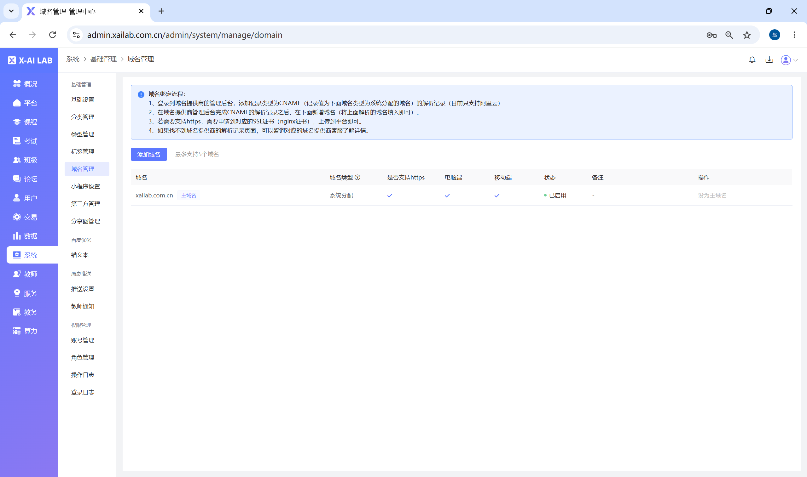

常用操作：

1. 查看当前域名配置。
2. 新增或修改平台访问域名。
3. 验证域名解析和访问状态。

注意事项：

1. 域名变更会影响用户访问，应提前完成解析和证书配置。
2. 修改后应检查门户、后台、接口和回调地址。

### 10.11 第三方管理

第三方管理用于维护外部应用、接口项目和第三方密钥。

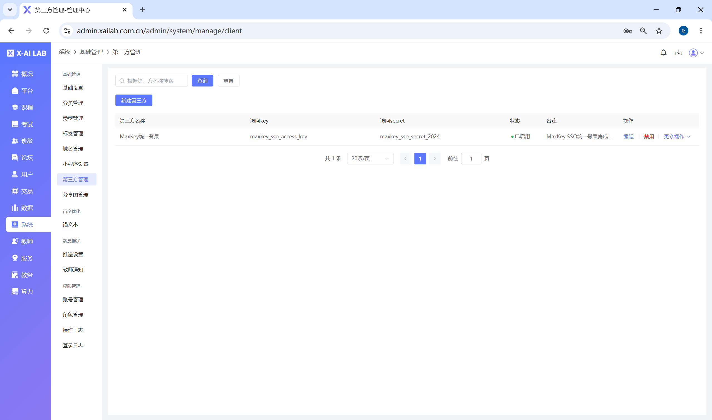

常用操作：

1. 新建第三方项目，配置项目名称、Key、Secret 和权限。
2. 禁用第三方项目状态。
3. 重置第三方 Secret 或 Key。
4. 删除不再使用的项目。

注意事项：

1. 第三方密钥应定期轮换，并限制访问权限。
2. 删除第三方项目前应确认外部系统已停用该接口。

### 10.12 教师通知

教师通知用于向教师端发布系统通知或业务提醒。

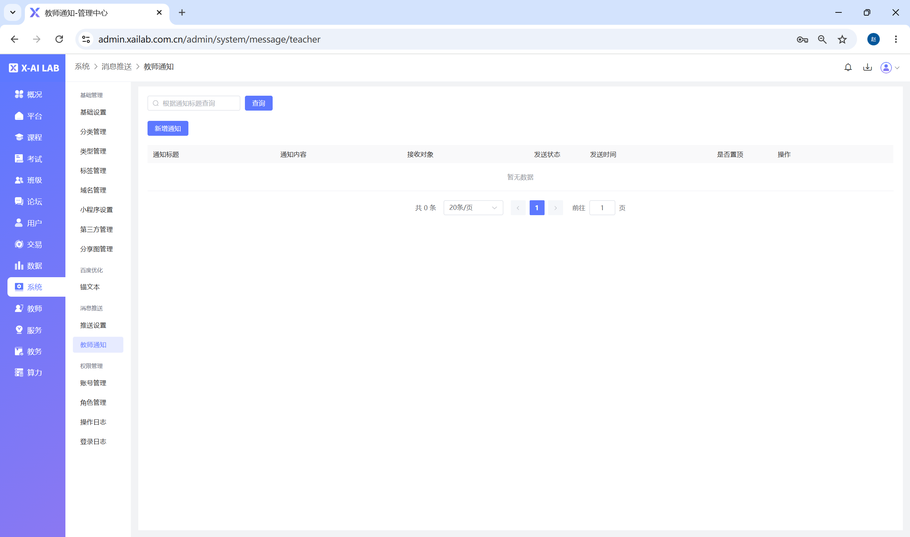

常用操作：

1. 新增通知，填写标题、内容、接收范围和发布时间。
2. 查看通知发送状态。
3. 管理历史通知。

注意事项：

1. 通知内容应明确、简洁，避免重复发送。
2. 重要通知发布前应确认接收对象。

### 10.13 类型管理

类型管理用于维护课程类型、试卷类型等系统业务类型。

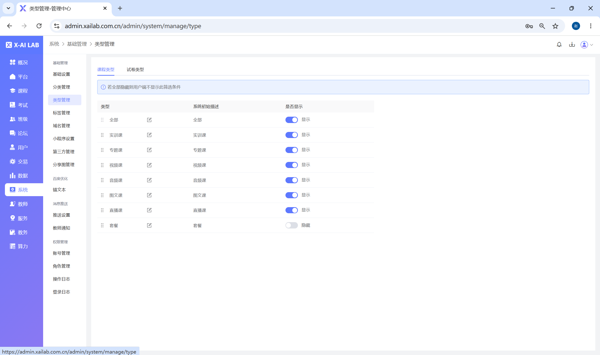

常用操作：

1. 进入课程类型或试卷类型页面。
2. 新增、编辑或删除类型。
3. 调整类型排序。

注意事项：

1. 类型会影响业务筛选和数据归档，应统一命名。
2. 删除前应确认是否有关联课程或试卷。

### 10.14 分享图管理

分享图管理用于维护课程、活动、页面等分享场景的图片。

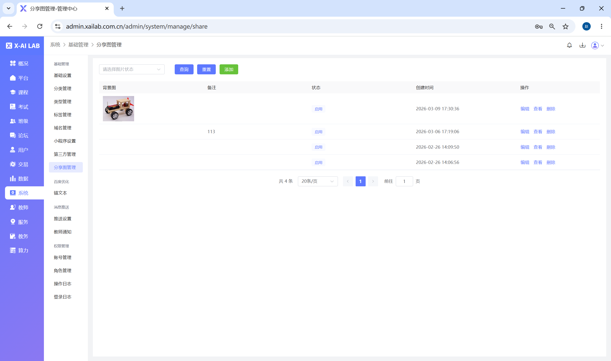

常用操作：

1. 添加分享图，上传图片并设置使用场景。
2. 编辑分享图信息。
3. 删除不再使用的分享图。

注意事项：

1. 分享图尺寸和内容应符合前端展示要求。
2. 发布前应检查在微信、小程序或浏览器中的分享效果。

### 10.15 推送设置

推送设置用于维护消息推送相关参数。

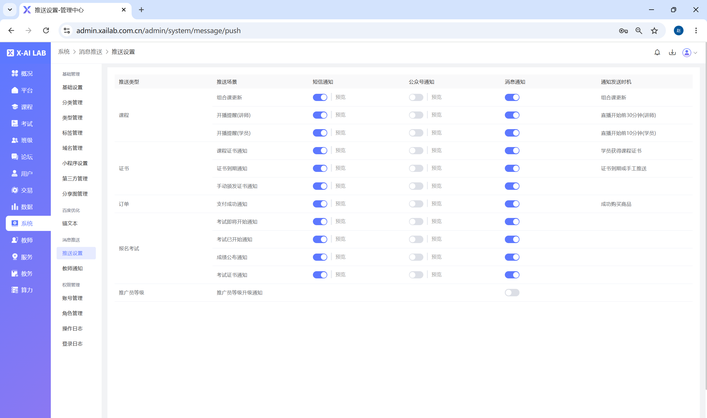

常用操作：

1. 配置推送渠道、模板和开关状态。
2. 保存后测试消息触达情况。
3. 根据业务需要调整推送策略。

注意事项：

1. 推送过于频繁会影响用户体验，应合理控制频次。
2. 模板变更后应检查变量是否正确渲染。

### 10.16 锚文本

锚文本用于维护站内特定关键词和跳转链接。

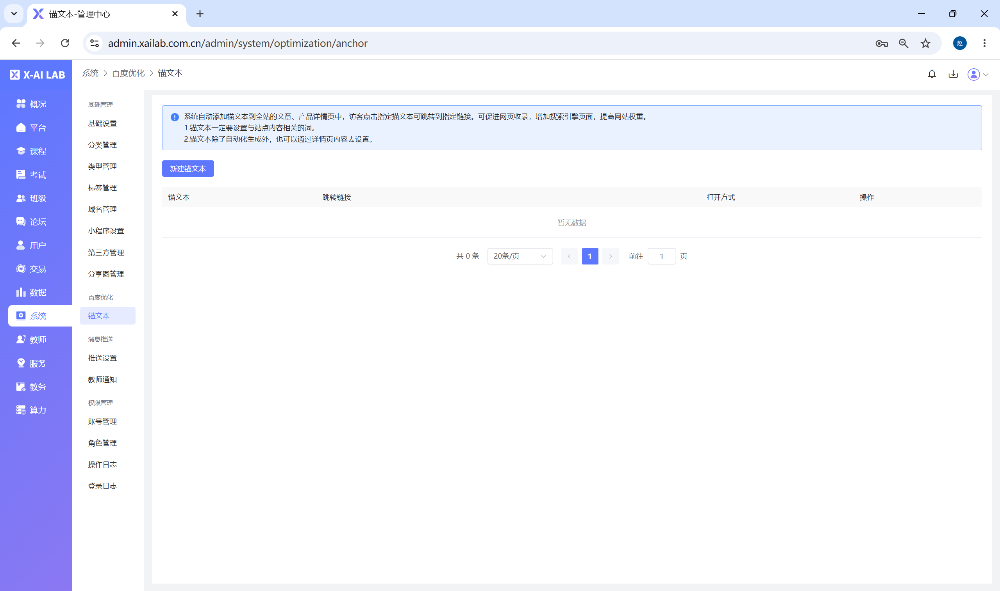

常用操作：

1. 新建锚文本，设置关键词和跳转链接。
2. 编辑锚文本内容。
3. 删除不再使用的锚文本。

注意事项：

1. 锚文本应与内容主题相关，避免影响阅读体验。
2. 链接变更后应及时检查跳转是否有效。

## 11. 教师

### 11.1 功能说明

“教师”菜单用于从管理员视角查看和管理教师侧的课程、班级、素材库、题目库、试卷库和专题课等内容。该模块便于管理员协助教师处理内容建设、资源维护和教学管理。

### 11.2 视频课

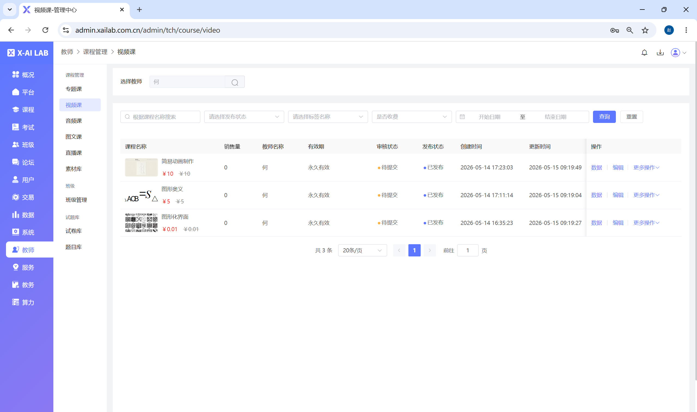

常用操作：

1. 查看教师创建的视频课程。
2. 协助编辑课程信息、检查课程状态和数据。
3. 对异常课程进行删除或调整。

### 11.3 音频课

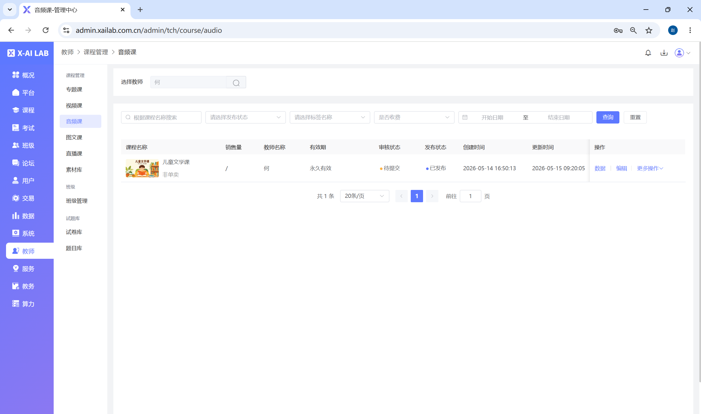

常用操作：

1. 查看教师创建的音频课程。
2. 检查音频素材、章节和发布状态。
3. 根据需要协助教师维护课程。

### 11.4 图文课

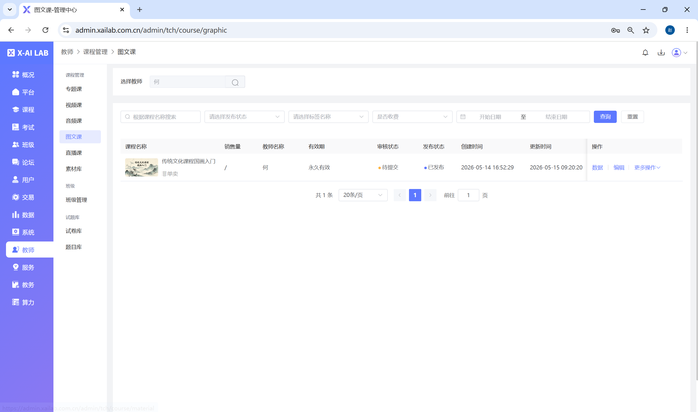

常用操作：

1. 查看教师创建的图文课程。
2. 检查正文、图片、附件和章节内容。
3. 协助处理发布、下架或删除事项。

### 11.5 直播课

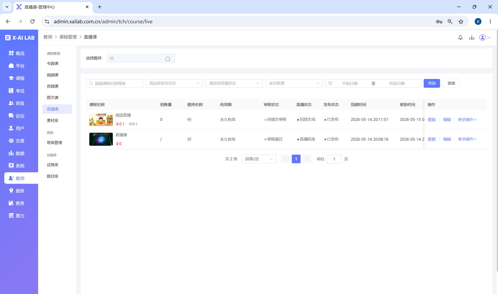

常用操作：

1. 查看教师发起的直播课。
2. 检查直播时间、直播信息和直播状态。
3. 协助处理取消直播、修改状态或查看数据。

### 11.6 班级管理

常用操作：

1. 查看教师负责的班级。
2. 管理班级成员、课程和学习任务。
3. 处理班级发布、邀请和审核设置。

### 11.7 素材库

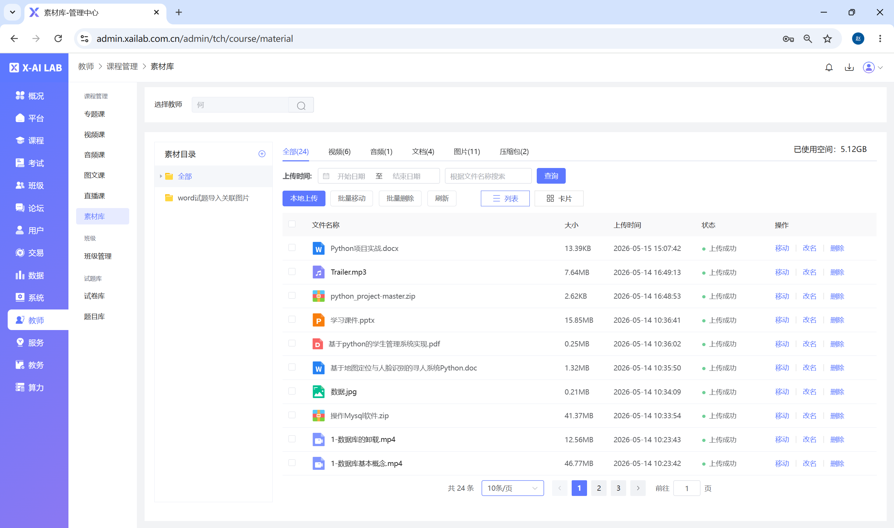

常用操作：

1. 查看教师上传的教学素材。
2. 按视频、音频、图片、文档等类型筛选。
3. 协助教师整理、移动或删除素材。

### 11.8 题目库

常用操作：

1. 查看教师创建的题目。
2. 协助导入、预览、复制、移动或删除题目。
3. 检查题目答案、解析和适用范围。

### 11.9 试卷库

常用操作：

1. 查看教师创建的试卷。
2. 协助添加、导入、预览、复制、移动或删除试卷。
3. 检查试卷分值、题目组成和考试适用性。

### 11.10 专题课

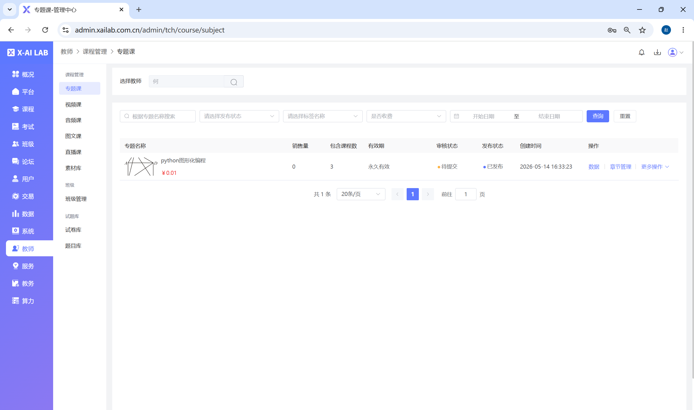

常用操作：

1. 查看教师创建的专题课。
2. 协助维护章节、内容和发布状态。
3. 查看专题学习数据并支持后续优化。

### 11.11 注意事项

1. 管理员协助教师操作时，应尊重教师内容归属和教学安排。
2. 涉及删除课程、题目、试卷或素材时，应提前确认是否被班级、考试或课程引用。

## 12. 服务

### 12.1 功能说明

“服务”菜单用于管理平台基础服务与 AI 实训服务，包括智能体应用、GPU、算力、镜像、访问控制、云原生安全、代码仓库、数据分析、算力监控和成本统计等。该模块主要面向运维管理员、平台管理员和实训资源管理员。

### 12.2 智能体应用

智能体应用用于管理平台中的 AI 智能体服务。

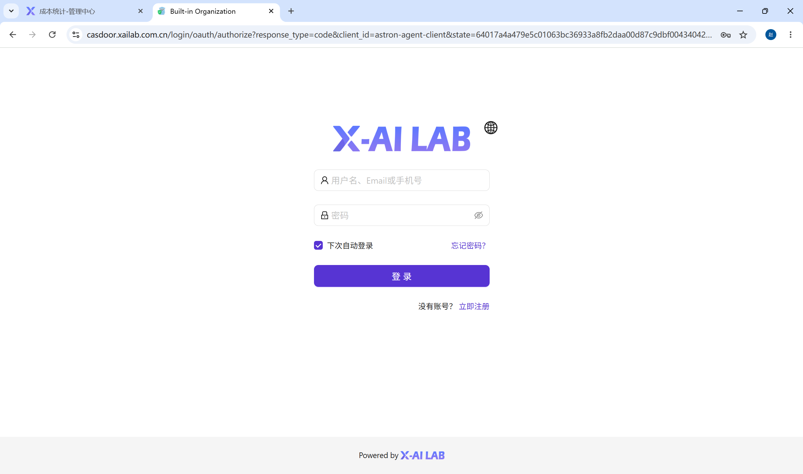

常用操作：

1. 查看智能体应用列表和运行状态。
2. 管理智能体应用配置、发布状态和访问入口。
3. 根据业务需要启用或停用应用。

注意事项：

1. 智能体应用可能关联模型、知识库或插件，应确认依赖可用。
2. 停用应用前应确认是否有课程或用户正在使用。

### 12.3 GPU 管理

GPU 管理用于查看和维护 GPU 资源。

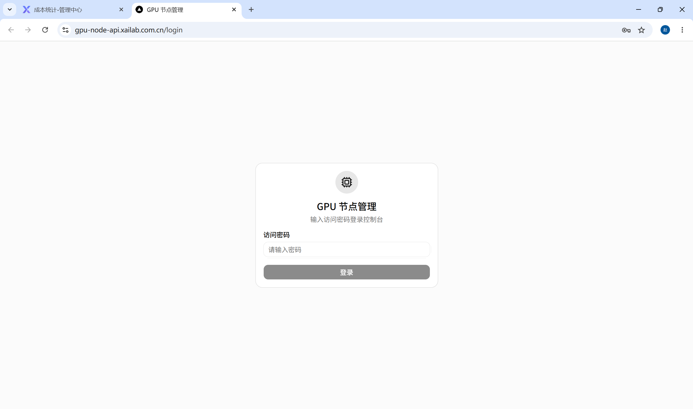

常用操作：

1. 查看 GPU 资源状态、节点信息和使用情况。
2. 监控资源占用，排查异常任务。
3. 根据教学或实训需求分配资源。

注意事项：

1. GPU 资源成本较高，应合理规划和回收。
2. 异常占用需结合算力监控和实例信息排查。

### 12.4 算力管理

算力管理用于管理平台算力资源和调度情况。

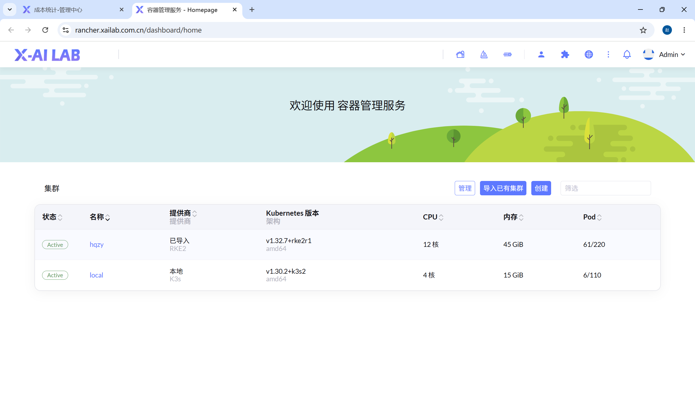

常用操作：

1. 查看算力资源总量、使用量和剩余量。
2. 管理算力资源分配和使用策略。
3. 处理异常实例或资源占用。

注意事项：

1. 算力配置变更会影响实训环境，应谨慎操作。
2. 资源不足时应优先保障教学和考试等关键场景。

### 12.5 镜像管理

镜像管理用于维护实训环境所需容器镜像。

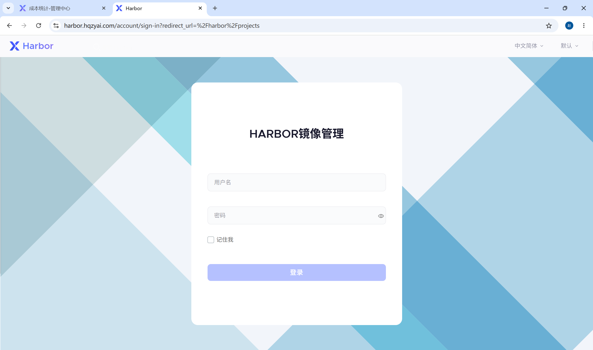

常用操作：

1. 查看镜像列表、版本、状态和更新时间。
2. 新增或更新镜像。
3. 删除不再使用的镜像。

注意事项：

1. 镜像变更会影响实验环境启动，应先在测试环境验证。
2. 删除镜像前应确认没有课程、实训或实例正在使用。

### 12.6 访问控制

访问控制用于配置服务访问权限。

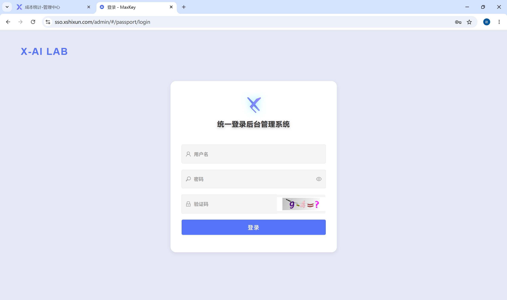

常用操作：

1. 查看访问控制策略。
2. 配置用户、角色、服务或资源访问权限。
3. 启用、停用或调整访问策略。

注意事项：

1. 访问控制直接影响服务安全，应按最小权限配置。
2. 权限变更后应验证相关用户是否能正常访问。

### 12.7 云原生安全

云原生安全用于查看和处理容器、镜像、集群和运行时安全相关信息。

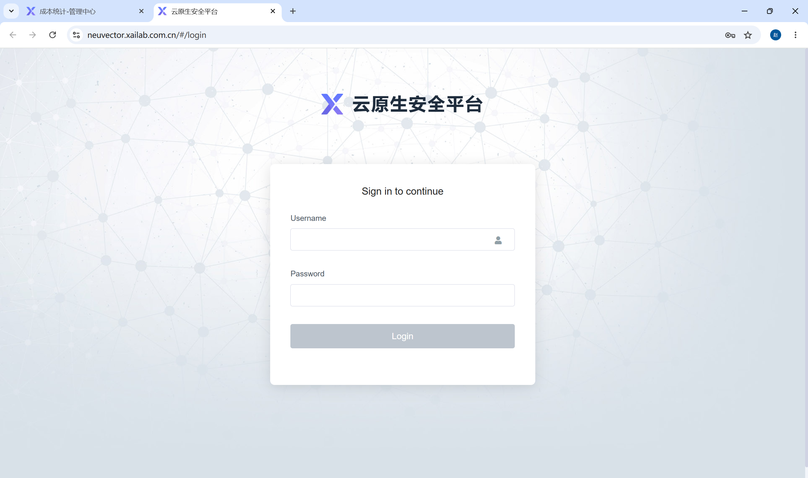

常用操作：

1. 查看安全检测结果和风险列表。
2. 对镜像漏洞、配置风险或运行异常进行处理。
3. 跟踪安全整改状态。

注意事项：

1. 高危安全风险应优先处理。
2. 安全整改应与运维发布流程配合，避免影响运行服务。

### 12.8 代码仓库管理

代码仓库管理用于维护实训或项目代码仓库。

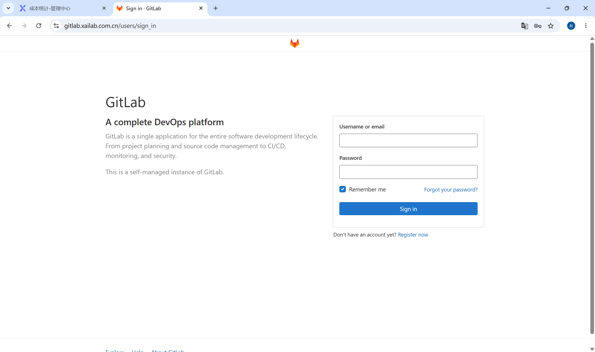

常用操作：

1. 查看代码仓库列表和访问状态。
2. 配置仓库地址、访问凭据和权限。
3. 维护课程或实训关联的代码资源。

注意事项：

1. 仓库凭据应妥善保管。
2. 修改仓库地址前应确认课程和实训项目引用关系。

### 12.9 数据分析

服务侧数据分析用于查看基础服务和实训资源相关分析数据。

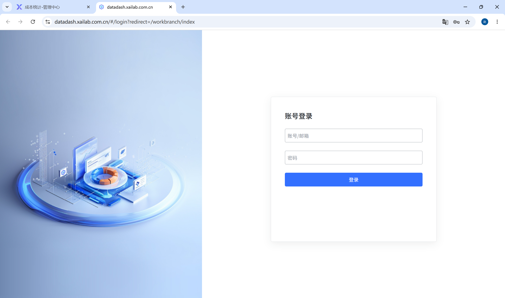

常用操作：

1. 查看服务资源使用、运行趋势和异常指标。
2. 按时间或资源维度筛选数据。
3. 支持资源规划和运维决策。

注意事项：

1. 服务数据应与监控和成本统计结合分析。
2. 异常指标应及时排查，避免影响学员实训。

### 12.10 算力监控 Grafana

算力监控 Grafana 用于查看算力资源运行监控图表。

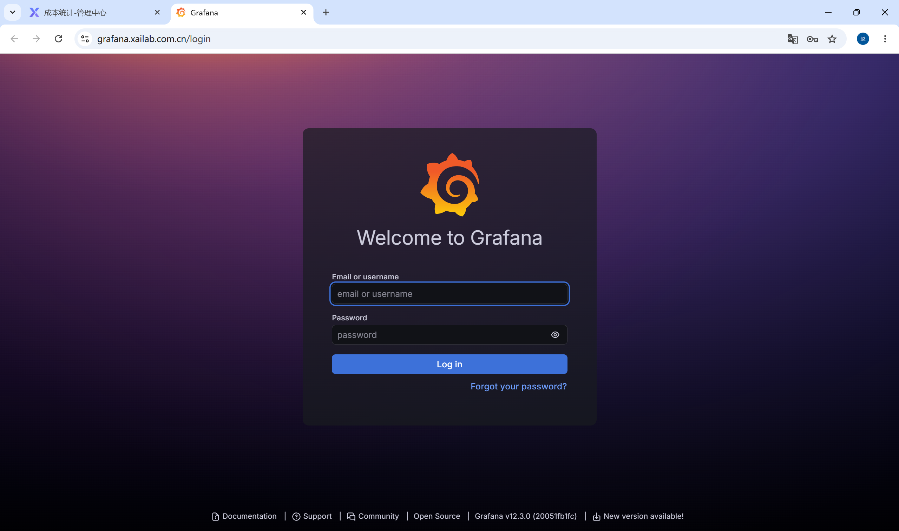

常用操作：

1. 查看 GPU、CPU、内存、存储和网络等监控指标。
2. 根据时间范围定位资源峰值和异常。
3. 配合告警或日志处理资源问题。

注意事项：

1. 监控异常应结合具体实例和任务进一步定位。
2. 高峰期应关注资源水位，避免任务启动失败。

### 12.11 成本统计

成本统计用于查看算力和基础服务资源成本。

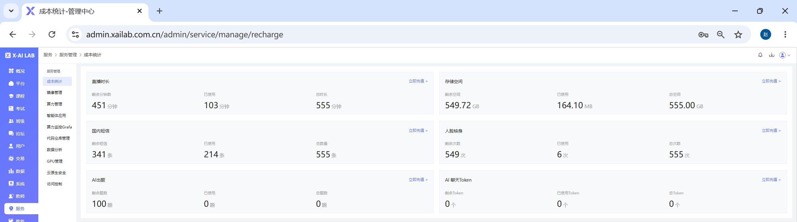

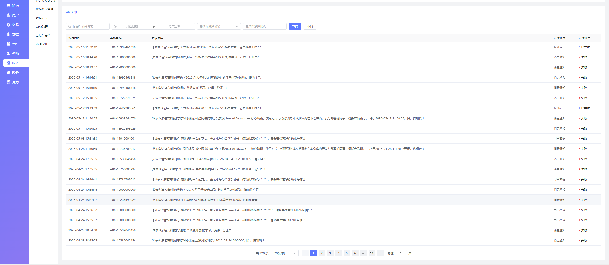

常用操作：

1. 查看不同资源、项目或时间段的成本数据。
2. 分析资源消耗趋势。
3. 为算力配额、课程排期和资源采购提供依据。

注意事项：

1. 成本数据应与实际资源使用和财务口径核对。
2. 对异常成本增长应及时排查资源占用和任务情况。

## 13. 教务

### 13.1 功能说明

“教务”菜单用于管理学期和培养方向，是平台教学组织、课程计划和班级管理的基础配置。

### 13.2 学期管理

学期管理用于维护教学学期。

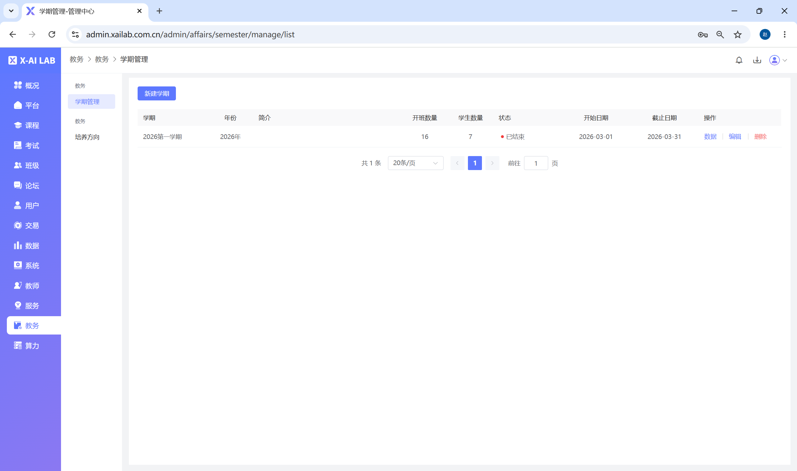

常用操作：

1. 新建学期，填写学期名称、开始时间和结束时间。
2. 查看学期数据，了解学期内课程、班级或学习情况。
3. 删除不再使用的学期。

注意事项：

1. 学期通常被班级、课程计划和教学数据引用，应谨慎删除。
2. 学期时间应与实际教学安排一致。

### 13.3 培养方向

培养方向用于维护 AI 人才培养路径，如大模型应用、机器学习、计算机视觉、数据分析等方向。

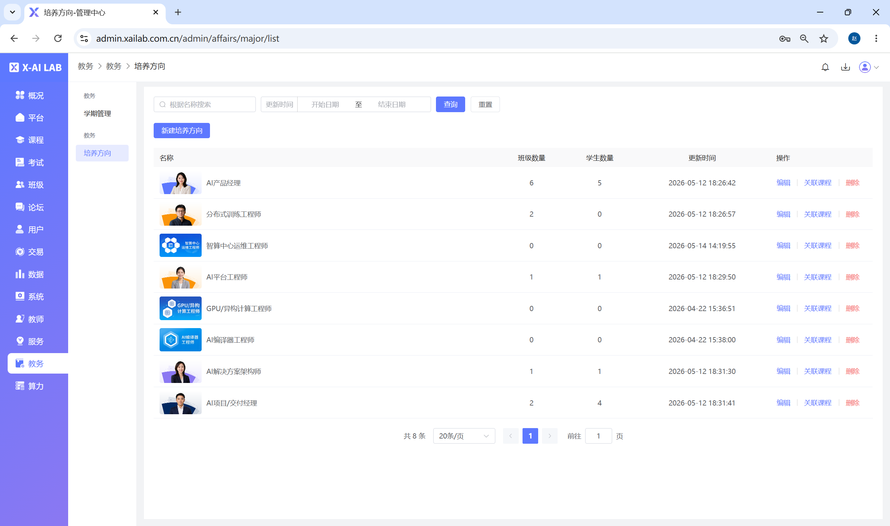

常用操作：

1. 新建培养方向，填写方向名称、说明和排序。
2. 关联课程，形成方向学习路径。
3. 删除不再使用的培养方向。

注意事项：

1. 培养方向会影响学生端课程路径展示，应保持结构清晰。
2. 删除前应确认是否有关联课程、班级或学习计划。

## 14. 算力

### 14.1 功能说明

“算力”菜单用于管理用户算力账户、算力设置和实例规格计费。该模块支持平台对实训资源的分配、计费和使用管控。

### 14.2 算力账户管理

算力账户管理用于查看用户或机构的算力账户信息。

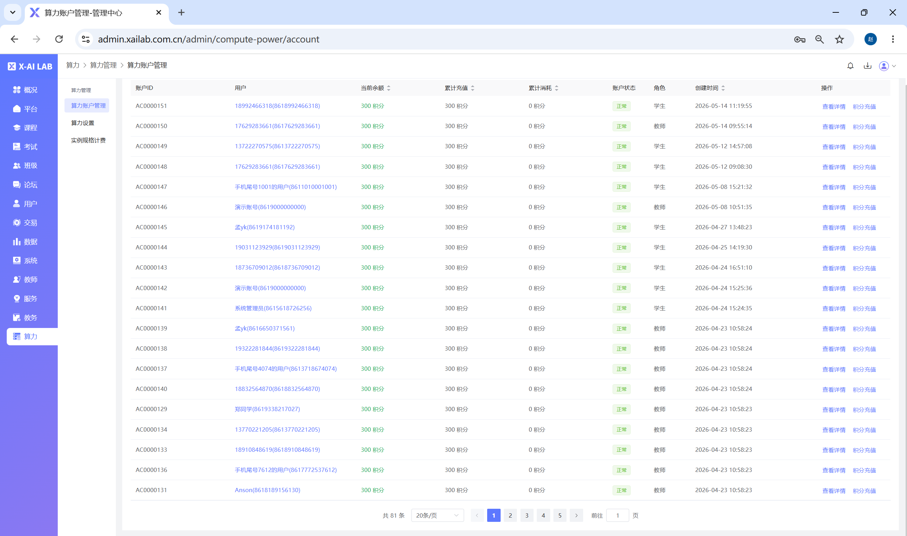

常用操作：

1. 查看算力账户列表、余额或积分。
2. 查看账户详情，了解使用记录和资源消耗。
3. 为账户进行积分充值。

注意事项：

1. 算力充值会影响用户可用资源，应核对对象和数量。
2. 账户异常时应结合实例记录和成本统计排查。

### 14.3 算力设置

算力设置用于维护平台算力相关基础配置。

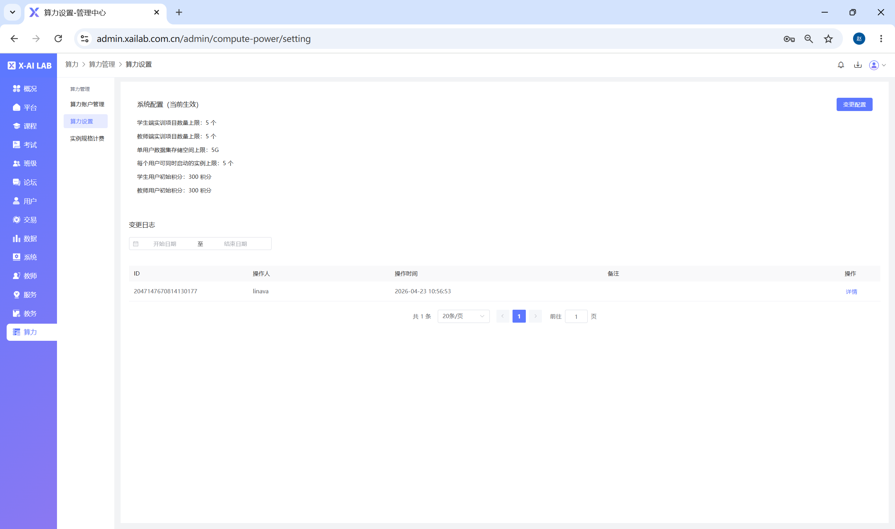

常用操作：

1. 查看当前算力配置。
2. 根据平台策略变更配置。
3. 保存后验证实训环境和算力使用是否正常。

注意事项：

1. 算力配置影响实训环境启动和计费，应谨慎变更。
2. 配置变更前应记录原配置，便于回退。

### 14.4 实例规格计费

实例规格计费用于维护不同算力实例规格和计费规则。

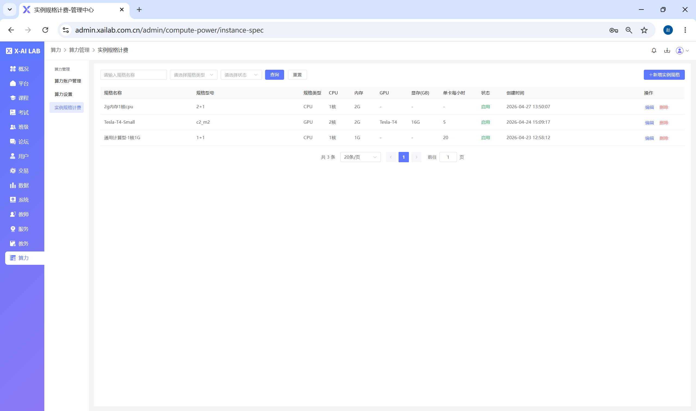

常用操作：

1. 新增实例规格，配置 CPU、内存、GPU、存储和价格。
2. 编辑已有规格。
3. 删除不再使用的规格。

注意事项：

1. 实例规格应与实际资源池能力一致。
2. 删除规格前应确认没有课程、实验或实例正在使用该规格。

## 15. 常见问题处理

### 15.1 页面数据为空

处理建议：

1. 检查筛选条件是否过窄。
2. 确认当前账号是否具备查看权限。
3. 检查业务数据是否已创建或已发布。
4. 如仍无法查看，联系系统运维检查接口或服务状态。

### 15.2 图片或视频无法正常显示

处理建议：

1. 检查素材是否上传成功。
2. 检查素材格式、大小和转码状态。
3. 检查课程、资讯或店铺页面是否引用了正确素材。
4. 检查对象存储、CDN 或访问域名是否正常。

### 15.3 课程或考试前台不可见

处理建议：

1. 检查课程或考试是否已发布。
2. 检查分类、展示时间、用户权限和班级范围。
3. 检查课程审核或考试配置是否完成。
4. 检查前台缓存或刷新页面后再次查看。

### 15.4 用户无法进入实训环境

处理建议：

1. 检查用户是否具备课程或实训权限。
2. 检查算力账户余额或积分是否充足。
3. 检查镜像、实例规格和算力资源是否可用。
4. 通过服务、算力监控和日志进一步定位。

### 15.5 支付或订单异常

处理建议：

1. 检查订单状态、支付渠道和回调记录。
2. 检查支付设置中的商户号、密钥和回调地址。
3. 与支付平台账单进行核对。
4. 对退款、补单等操作进行留痕。

## 16. 附录：管理员日常巡检建议

1. 每日查看概况页，关注用户、订单、课程、考试和待办数据。
2. 每日处理课程审核、教师审核、班级审核、话题审核、发票审核和提现审核。
3. 定期检查课程素材、题库试卷、店铺装修和资讯公告内容。
4. 定期查看交易分析、用户分析和商品分析，调整运营策略。
5. 定期检查角色权限、管理员账号、登录日志和操作日志。
6. 定期检查 GPU、算力、镜像、访问控制、云原生安全和成本统计。
7. 重大配置变更前做好记录，变更后进行功能验证。

