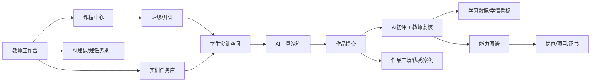

# AI教育平台市场产品调研

调研日期：2026-06-23  
调研对象：国内外教育领域 AI 平台，重点关注教师生产力、学生个性化学习、AI 实训/人才培养、课程与评价平台。  
资料来源：公开官网/产品页、用户提供的参考竞品页面、浏览器实测页面。本文为代表性平台梳理，不等同于全量市场名录。

## 1. 结论摘要

教育 AI 平台正在从“单点工具”走向“教学闭环平台”。目前可以明显分成五类：

1. 教师生产力平台：AI 备课、课件生成、命题组题、作业批改、学情分析。代表：飞象老师、希沃、讯飞、MagicSchool、Diffit。
2. 学生个性化学习平台：AI 答疑、苏格拉底式引导、自适应练习、学习路径推荐。代表：Khanmigo、松鼠Ai、学而思/好未来、网易有道、CENTURY。
3. AI 实训/人才培养平台：课程中心、实训任务、工具沙箱、作品提交、能力图谱、岗位对接。代表：智谱中联、章鱼·领会、Coursera Campus 等。
4. 智能评价与教学管理平台：AI 辅助阅卷、相似答案聚类、Rubric 评分、课程数据看板。代表：Gradescope、Canvas/Turnitin 生态、国内学习通/雨课堂等。
5. 通用大模型教育版：面向学校/高校提供安全合规的 AI 助手、管理控制、数据保护。代表：ChatGPT Edu、Google Gemini for Education、Microsoft Copilot for Education。

对“实训平台V2”的核心启示：不要只做 AI 工具入口，而要做“课程目标 - 实训任务 - AI 工具 - 过程数据 - 作品评价 - 能力画像 - 就业/项目场景”的闭环。智谱中联在“平台闭环”上最接近，飞象老师在“低门槛教师共创”和“资源社区”上值得借鉴。

## 2. 重点参考竞品拆解

### 2.1 飞象老师

官网：[https://www.feixianglaoshi.com/#/home?featureId=20](https://www.feixianglaoshi.com/#/home?featureId=20)

定位：面向教师的 AI 教学内容创作平台，偏 K12/职业教育/高等教育教师日常备课、课件、命题和课堂互动提效。

核心用户：

- 一线教师：快速生成互动课件、教案、试题、课堂活动。
- 教研/备课组：沉淀案例、复用热门资源、复制优秀提示词。
- 学校/机构：提升教师 AI 应用普及率。

实测看到的核心功能：

- AI互动课件：生成互动课件、教学动画、教学游戏、数据回收类课堂工具。
- AI命题：上传/输入命题素材和要求，生成原创题目，结果以 docx 等文档形态展示。
- AI组题：围绕错因、知识点、考试场景检索/组合题目。
- AI教案·大单元：生成课时教案和大单元教学设计。
- 资源广场：按推荐、语文、数学、英语、物理、化学、信息科技、课堂工具、学前教育、高等教育、职业教育等分类浏览。
- 热门案例与提示词：如“生成中考阅读题”“错因分析并组针对性练习”“小学数学黄金矿工计算练习”等，降低新用户使用门槛。

优势：

- 入口非常教师友好，围绕真实教学任务命名，而不是围绕技术名词命名。
- 有资源社区和热门案例，能让教师先看成果再创作。
- 生成物贴近教师交付物：课件、动画、游戏、docx 试题/教案。

短板/风险：

- 更偏内容创作和课堂互动，不是完整教学管理或实训管理平台。
- 未登录情况下对评分、班级、学习过程数据、能力图谱等闭环能力展示较少。
- 如果要进入高校 AI 实训场景，需要补“任务编排、工具沙箱、过程评价、作品沉淀、能力画像”。

对实训平台V2的启发：

- 首页/工作台应以“我要备课、我要出题、我要布置实训、我要评价作品”等任务表达，而不是只列 AI 能力。
- 每个实训模块都应配“热门模板/优秀作品/可复制任务”，降低教师建课成本。
- 实训作品最好支持文档、网页、代码、报告、视频等多形态沉淀。

### 2.2 智谱中联

官网：[https://zpzl.lhrj.cn/#/zhipuHome](https://zpzl.lhrj.cn/#/zhipuHome)

定位：面向院校 AI 人才培养的综合实训平台，覆盖课程、班级、实训、人才培养、能力图谱、教务和企业岗位。

核心用户：

- 高校/高职院校：建设人工智能、数字商业、大数据等课程与实训体系。
- 教师/教务：开课、建课、编排实训、查看学生数据。
- 学生：完成 Prompt、RAG、Agent、Workflow、多模态等实训，提交作品。
- 企业/生态伙伴：提供岗位、项目、实习机会。

实测看到的核心功能：

- 工作台：最近开课、学生数据、企业岗位招募。
- AI智课：课程中心、授权课程、自建课程、校内共享课程；支持自定义建课、导入 AI 课程、智能建课。
- 班级管理：面向开班和学生管理。
- 实训中心：提供实训空间、平台筛选、我的作品、实训广场、我的实训。
- 实训平台类型：生成式AI、Prompt、RAG、多模态、具身智能、Workflow、Agent、数字人、大模型开发、综合实践、数据集构建与评测、Vibe Coding、MLOps、微调。
- 能力图谱：按岗位拆解能力，如算法工程师、数据分析师、大模型算法、AI产品经理等；能力图谱含职业能力、能力单元、技能点，并支持缩放、下载图片和招聘数据入口。
- 就业对接：岗位卡片包含实习/正式、方向、地点、公司和投递入口。

优势：

- 平台闭环完整，覆盖“课程 - 班级 - 实训 - 数据 - 能力 - 岗位”。
- 实训模块颗粒度贴近当前 AI 应用开发岗位，尤其是 RAG、Agent、Workflow、MLOps、微调、Vibe Coding。
- 能力图谱与岗位体系结合，利于院校采购和人才培养方案汇报。

短板/风险：

- 功能多，学习曲线可能高于单点教师工具。
- 需要高质量课程、实训题、评分 Rubric 和企业岗位持续维护，否则平台容易变成“工具集合”。
- 部分实训工具嵌入 iframe，需关注账号体系、数据回传、权限、稳定性。

对实训平台V2的启发：

- 主线要围绕“实训任务”而不是“模型工具”，每个任务应绑定知识点、能力点、评价标准和成果物。
- 能力图谱是 B2B 院校场景的重要差异化模块，建议 V2 从岗位能力模型开始设计数据结构。
- 加入“实训广场/作品广场”，让学生作品、教师任务和优秀案例形成可复用资产。

### 2.3 课件帮

官网：[https://kejian365.com/](https://kejian365.com/)

定位：智能数字人视频课件一站式创作平台，面向教师、企业内训、市场培训和知识内容生产者。

核心功能：

- AI生成PPT：输入主题或文本，生成结构化演示文稿。
- PPT转视频：上传 PPT，选择数字人形象和声音，一键生成讲解视频。
- 智能配图、排版美化、内容扩写润色、文档生成 PPT、保持原文生成、多语言内容生成。
- 视频侧能力：数字人形象、40+ 国声音音色、字幕、进度导航、企业素材库、数字人/声音定制。

启发：

- 实训平台V2可以把“AI课件/实训导学视频生成”作为教师端配套能力。
- 数字人不是核心，但适合作为课程导学、企业案例讲解、学生作品展示的增值功能。

### 2.4 章鱼·领会

官网：[https://www.ailinghui.com/#/index/home](https://www.ailinghui.com/#/index/home)

定位：智适应学习平台，聚合课程、训练、岗位和机构入驻，偏 IT/AI/大数据职业教育。

核心功能/内容：

- 精选课程：Hadoop、Spark、Linux、HBase、人工智能通识、人工智能导论、Python、DeepSeek 安装部署与应用等。
- 实训：openGauss、Python数据采集、大模型应用与实践、自然语言处理、Linux、Hive、HBase、TensorFlow 等。
- 岗位：大数据开发工程师、大模型应用工程师、Web开发工程师等，岗位绑定课程数量和学习人数。
- 机构入驻和交流社区。

启发：

- 课程、实训、岗位三层联动清晰，适合职业教育平台参考。
- 实训平台V2应让每个岗位路径对应“课程包 + 实训包 + 作品要求 + 能力证明”。

## 3. 国内代表性平台矩阵

| 平台 | 类型 | 主要用户 | 特色功能 | 商业/落地场景 | 对实训平台V2启发 | 来源 |
|---|---|---|---|---|---|---|
| 飞象老师 | 教师 AI 创作/课件/命题 | K12、高校、职教教师 | AI互动课件、AI命题、AI组题、大单元教案、资源广场 | 教师个人/学校采购/内容社区 | 用任务化入口和案例广场降低教师使用门槛 | [官网](https://www.feixianglaoshi.com/#/home?featureId=20) |
| 智谱中联 | AI实训/人才培养平台 | 高校、高职、学生、教务 | AI智课、实训中心、能力图谱、岗位对接、班级管理 | 院校 AI 人才培养方案 | 建立课程-实训-评价-能力-就业闭环 | [官网](https://zpzl.lhrj.cn/#/zhipuHome) |
| 课件帮 | AI课件/数字人视频 | 教师、企业内训、培训机构 | AI生成PPT、PPT转数字人视频、字幕、模板、素材库 | 课件生产、培训视频、企业服务 | 教师端可内置课件/导学视频生成 | [官网](https://kejian365.com/) |
| 章鱼·领会 | 智适应学习/职业实训 | 职教学生、机构、企业岗位学习者 | 课程、实训、岗位路径、机构入驻 | IT/AI/大数据职业教育 | 岗位路径与课程/实训绑定 | [官网](https://www.ailinghui.com/#/index/home) |
| 科大讯飞智慧教育/星火教育能力 | 教育大模型+区域/学校解决方案 | 教育局、学校、教师、学生 | 智慧课堂、因材施教、作业/考试/学情、星火大模型教育应用 | 区域智慧教育、学校数字化 | 教师与学生数据闭环、区域级治理能力 | [官网](https://edu.iflytek.com/) |
| 希沃/希沃教学大模型 | 教师 AI 助手+智慧课堂硬件生态 | K12 学校和教师 | AI备课、课堂互动、课件/白板生态、教学大模型 | 学校教学硬件+软件订阅 | 与课堂硬件/白板结合，提高进课堂频率 | [官网](https://www.seewo.com/) |
| 好未来/学而思九章大模型 MathGPT | 学科大模型/学习硬件 | K12 学生、家长、教师 | 数学解题、个性化辅导、学习机/内容生态 | C端学习硬件、在线学习 | 垂直学科模型和解题过程反馈 | [官网](https://en.100tal.com/) |
| 网易有道/子曰教育大模型 | 学习硬件+教育大模型 | 学生、家长、教师 | 词典笔、学习机、翻译、AI问答与学习辅助 | C端硬件、学校/企业服务 | 多终端学习入口和语言学习能力 | [官网](https://www.youdao.com/) |
| 松鼠Ai | 自适应学习 | K12学生、教培机构 | 知识点诊断、自适应路径、个性化练习 | 线下学习中心/在线学习 | 用知识图谱和诊断题支撑个性化路径 | [官网](https://squirrelai.com/) |
| 作业帮 | AI学习/题库/拍搜 | K12学生、家长 | 拍照搜题、作业批改、学习机、题库练习 | C端 App/学习硬件 | 高频学习场景入口和题库资产 | [官网](https://www.zybang.com/) |
| 学堂在线/雨课堂 | 高校在线课程与智慧教学 | 高校教师、学生、教务 | MOOC、课堂互动、学习数据、AI助教类能力 | 高校课程平台 | 适合参考高校课程组织与数据看板 | [学堂在线](https://www.xuetangx.com/) |
| 超星学习通/泛雅 | 高校 LMS/资源平台 | 高校、教师、学生 | 课程资源、作业考试、教学互动、学习数据 | 高校信息化平台 | 实训平台需兼容既有 LMS 数据和教务流程 | [官网](https://www.chaoxing.com/) |
| 百度智能云/文心教育方案 | 大模型+智慧教育解决方案 | 教育局、学校、企业培训 | 文心大模型、知识库、智能问答、教育场景应用 | B2B 项目制/云服务 | 可参考知识库和智能体平台化能力 | [官网](https://cloud.baidu.com/solution/education.html) |
| 阿里云/钉钉/通义教育生态 | 通用大模型+协同平台 | 学校、企业培训、教师 | 通义能力、钉钉协同、智能问答和办公提效 | 校园协同/企业培训 | 管理端与协同工作流比单点 AI 更重要 | [钉钉](https://www.dingtalk.com/) |
| 腾讯教育/腾讯云智慧教育 | 云+音视频+教育应用 | 学校、教育机构、区域教育 | 云课堂、音视频、数据平台、AI能力接入 | 区域/学校信息化 | 可参考稳定音视频和云平台集成能力 | [官网](https://cloud.tencent.com/solution/education) |

## 4. 国外代表性平台矩阵

| 平台 | 类型 | 主要用户 | 特色功能 | 商业/落地场景 | 对实训平台V2启发 | 来源 |
|---|---|---|---|---|---|---|
| Khanmigo | AI导师/教师助手 | K12学生、教师、家长 | 苏格拉底式引导、写作/数学辅导、教师备课辅助 | 学校/家庭订阅、Khan Academy生态 | 学生端要“引导思考”而不是直接给答案 | [官网](https://www.khanmigo.ai/) |
| MagicSchool | 教师 AI 工具箱 | K12教师、学校、学区 | 教案、评语、Rubric、改写、IEP、课堂材料等多工具 | 教师个人/学校版 | 教师工具要轻量、多模板、可复制 | [官网](https://www.magicschool.ai/) |
| SchoolAI | AI课堂空间/学生体验 | 教师、学生、学区 | Spaces、AI活动、学生对话监控、教师控制台 | 学校/学区 | 实训中可设计“教师可监控的 AI 活动空间” | [官网](https://schoolai.com/) |
| Diffit | 教师内容改编 | K12教师 | 根据主题/资料生成不同阅读水平材料、词汇、问题和活动 | 教师备课 | 同一实训内容可按学生水平自动分层 | [官网](https://web.diffit.me/) |
| Gradescope | AI辅助评分 | 高校教师、助教、学生 | 手写/编程作业收集、相似答案分组、Rubric评分、反馈 | 高校课程评价 | 作品评分应结合 Rubric、相似答案聚类和人工复核 | [官网](https://www.gradescope.com/) |
| Duolingo Max | AI语言学习 | 语言学习者 | Explain My Answer、Roleplay 等 AI 互动练习 | C端订阅 | 语言/沟通类实训可用角色扮演增强沉浸感 | [官网/博客](https://blog.duolingo.com/duolingo-max/) |
| Coursera for Campus / AI能力 | 在线课程+AI学习支持 | 高校、企业、学习者 | 在线课程、项目证书、学习路径、AI辅助学习/内容能力 | 高校/企业培训 | 课程市场和证书体系可提升平台权威感 | [官网](https://www.coursera.org/campus/) |
| Carnegie Learning MATHia | 自适应数学学习 | K12学生、教师 | AI数学导师、自适应路径、过程数据 | 学校采购 | 对 STEM 实训可借鉴细粒度知识追踪 | [官网](https://www.carnegielearning.com/solutions/math/mathia/) |
| CENTURY Tech | 自适应学习平台 | K12学校、教师、学生 | 诊断、个性化学习路径、教师数据看板 | 学校采购 | 个性化练习应以诊断数据驱动 | [官网](https://www.century.tech/) |
| Knewton Alta | 高校自适应课程 | 高校学生、教师 | 自适应作业、学习路径、开放教育资源整合 | 高校课程材料 | 高校场景重视课程包和成本可控 | [官网](https://www.wiley.com/en-us/education/alta) |
| Quizizz AI | 测验/课堂互动 | 教师、学生 | AI生成测验、课堂互动、学习报告 | 教师个人/学校版 | 快速生成低风险练习题可作为入门能力 | [官网](https://quizizz.com/ai) |
| Google Gemini for Education | 教育版通用 AI 助手 | 学校、教师、学生、管理员 | Gemini 教育版、Workspace 集成、管理与数据保护 | 学校订阅 | 平台需提供组织级权限、合规和数据控制 | [官网](https://edu.google.com/ai/gemini-for-education/) |
| Microsoft Copilot for Education | 教育版通用 AI 助手 | 教师、学生、学校管理员 | Copilot、Microsoft 365/Teams 集成、教育场景提示 | 学校订阅 | 与办公/课堂协作软件集成很关键 | [官网](https://www.microsoft.com/en-us/education/products/copilot) |
| ChatGPT Edu | 高校版通用 AI 助手 | 高校、研究人员、学生、教职工 | 企业级 ChatGPT、校园管理、安全控制、数据保护 | 高校采购 | 大模型底座可作为校园级 AI 能力入口 | [官网](https://openai.com/chatgpt/education/) |
| Turnitin | 学术诚信/写作评价 | 高校、教师、学生 | 相似性检测、写作反馈、AI写作检测/学术诚信工作流 | 高校采购 | 实训作品需考虑原创性、引用和过程留痕 | [官网](https://www.turnitin.com/) |

## 5. 产品能力对比：从单点工具到实训闭环

| 能力层 | 典型功能 | 强代表 | V2建议 |
|---|---|---|---|
| 教师生产 | AI备课、课件、命题、Rubric、导学视频 | 飞象老师、课件帮、MagicSchool、希沃 | V2教师端先做“建课/建任务/建评分表”三件高频事 |
| 学生学习 | AI答疑、提示、角色扮演、个性化练习 | Khanmigo、Duolingo Max、松鼠Ai | 学生端避免直接给答案，强调过程引导和反思记录 |
| 实训工具 | Prompt、RAG、Agent、Workflow、多模态、MLOps、微调 | 智谱中联 | 工具必须绑定任务、数据集、提交物和评分标准 |
| 评价反馈 | 自动评分、相似答案聚类、Rubric、人工复核 | Gradescope | 建议引入“AI初评 + 教师复核 + 评分解释” |
| 数据画像 | 学情、能力图谱、岗位能力、学习路径 | 智谱中联、CENTURY、讯飞 | 能力图谱应从岗位能力模型开始，而非后补报表 |
| 生态运营 | 资源广场、作品广场、企业岗位、证书 | 飞象老师、章鱼·领会、Coursera | 做内容和作品资产沉淀，提升复用与展示价值 |
| 平台治理 | 组织权限、模型配额、审计、隐私合规 | Google/Microsoft/OpenAI 教育版 | B2B 院校交付必须有管理端、数据边界和成本控制 |

## 6. 实训平台V2功能建议

### 6.1 首期优先级

1. 课程/班级/实训任务三件套  
   教师可以建课程、开班、添加实训任务；学生可以进入任务、使用 AI 工具、提交作品。

2. 实训任务模板库  
   首批建议覆盖 Prompt、RAG、Agent、Workflow、多模态、AIGC选型、Vibe Coding。每个模板包含背景、目标、步骤、输入材料、提交物、Rubric、参考案例。

3. AI 工具沙箱  
   不是简单跳转外部工具，而是沉淀会话、文件、代码、报告、评分记录。优先支持对话模型、知识库/RAG、工作流编排、智能体配置、报告生成。

4. 作品与评分  
   支持报告、文档、链接、代码、图片/视频提交；系统做 AI 初评，教师可复核，学生能看到评分解释和改进建议。

5. 能力图谱最小版本  
   先围绕 3-5 个岗位建立能力模型，例如 AI应用工程师、Prompt工程师、RAG应用工程师、智能体开发工程师、AI产品经理。把每个实训任务映射到能力点。

6. 教师 AI 助手  
   提供“智能建课、智能建任务、智能生成评分表、根据学生作品生成点评”的教师端 AI 能力。

### 6.2 差异化方向

- 从“工具集合”升级为“可评价的实训闭环”：每个 AI 工具都要服务于任务和评分。
- 从“课程资源库”升级为“能力达成证据库”：学生每次提交都沉淀到作品集和能力画像。
- 从“教师单人备课”升级为“校内共享任务库”：支持院系共建、校内共享、复制改编。
- 从“平台内学习”延伸到“岗位/项目匹配”：引入企业项目、岗位技能要求、证书或实训证明。

### 6.3 风险与控制点

- 内容准确性：AI生成教案/题目/评分必须支持教师复核和版本记录。
- 数据安全：学生作品、对话、文件、成绩属于敏感教育数据，需要权限、审计、脱敏和导出策略。
- 模型成本：按课程、班级、任务设置模型配额和调用上限，避免不可控成本。
- 评分公平性：AI评分只能作为初评和建议，关键成绩应保留人工确认。
- 外部工具依赖：若嵌入第三方工具，需要统一账号、数据回传、SLA、异常兜底。
- 内容维护：AI技术更新很快，实训任务必须可迭代，建议设置“任务版本”和“适用模型版本”。

## 7. 建议的V2信息架构草案

## 8. 资料来源

- 飞象老师：[https://www.feixianglaoshi.com/#/home?featureId=20](https://www.feixianglaoshi.com/#/home?featureId=20)
- 智谱中联：[https://zpzl.lhrj.cn/#/zhipuHome](https://zpzl.lhrj.cn/#/zhipuHome)
- 课件帮：[https://kejian365.com/](https://kejian365.com/)
- 章鱼·领会：[https://www.ailinghui.com/#/index/home](https://www.ailinghui.com/#/index/home)
- 科大讯飞智慧教育：[https://edu.iflytek.com/](https://edu.iflytek.com/)
- 希沃：[https://www.seewo.com/](https://www.seewo.com/)
- 好未来/TAL：[https://en.100tal.com/](https://en.100tal.com/)
- 网易有道：[https://www.youdao.com/](https://www.youdao.com/)
- 松鼠Ai：[https://squirrelai.com/](https://squirrelai.com/)
- Khanmigo：[https://www.khanmigo.ai/](https://www.khanmigo.ai/)
- MagicSchool：[https://www.magicschool.ai/](https://www.magicschool.ai/)
- SchoolAI：[https://schoolai.com/](https://schoolai.com/)
- Diffit：[https://web.diffit.me/](https://web.diffit.me/)
- Gradescope：[https://www.gradescope.com/](https://www.gradescope.com/)
- Duolingo Max：[https://blog.duolingo.com/duolingo-max/](https://blog.duolingo.com/duolingo-max/)
- Coursera for Campus：[https://www.coursera.org/campus/](https://www.coursera.org/campus/)
- Google Gemini for Education：[https://edu.google.com/ai/gemini-for-education/](https://edu.google.com/ai/gemini-for-education/)
- Microsoft Copilot for Education：[https://www.microsoft.com/en-us/education/products/copilot](https://www.microsoft.com/en-us/education/products/copilot)
- ChatGPT Education：[https://openai.com/chatgpt/education/](https://openai.com/chatgpt/education/)
